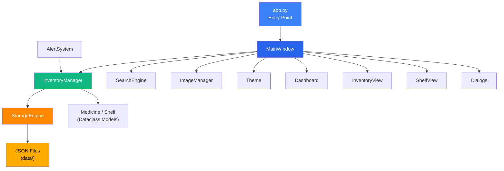
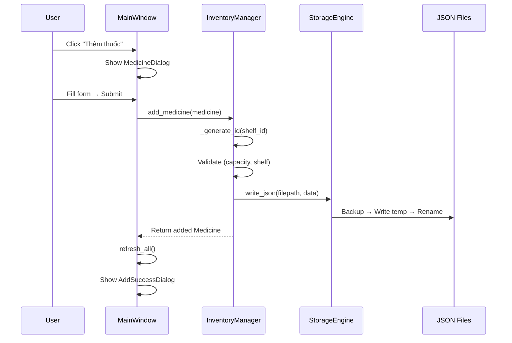
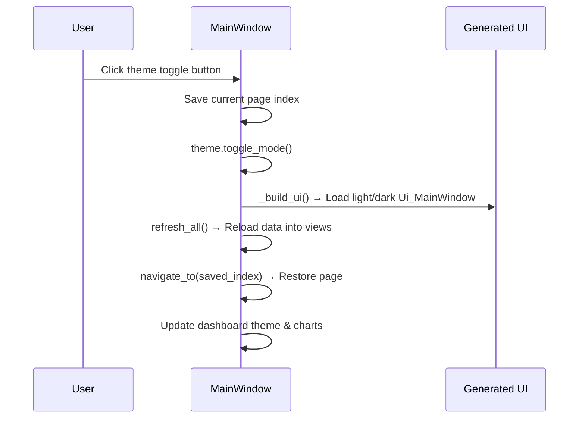

# 💊 PHARMA.SYS — Project Context

> **Dự án:** Hệ Thống Quản Lý Kho Thuốc  
> **Phiên bản:** 1.0.0 Beta  
> **Môn học:** Kỹ Thuật Lập Trình — Nhóm 3  
> **Ngày cập nhật context:** 26/03/2026 (cập nhật lần 3)

---

## 1. Tổng Quan

Ứng dụng desktop **quản lý kho thuốc** (Pharmacy Inventory Management) xây dựng bằng **Python + PyQt6**, hỗ trợ:

- CRUD thuốc & kệ thuốc
- Cảnh báo hết hạn / sắp hết hạn / tồn kho thấp / hết hàng
- Tìm kiếm mờ (fuzzy search) bằng TheFuzz
- Dashboard thống kê với biểu đồ Matplotlib
- Chế độ Light / Dark mode (giữ nguyên trang hiện tại khi chuyển theme)
- Lưu trữ dữ liệu bằng JSON files với cơ chế atomic write + backup

---

## 2. Tech Stack

| Thành phần       | Công nghệ                      |
|------------------|--------------------------------|
| Ngôn ngữ         | Python 3.13+                   |
| UI Framework     | PyQt6 ≥ 6.6.0                  |
| Charts           | Matplotlib ≥ 3.8.0             |
| Fuzzy Search     | TheFuzz ≥ 0.22.0 + python-Levenshtein |
| Data Storage     | JSON files (atomic writes)     |
| UI Design        | Qt Designer (.ui files)        |
| Testing          | pytest (~107 tests)            |

---

## 3. Cấu Trúc Thư Mục

```
KiThuatLapTrinhNhom3/
├── app.py                      # 🚀 Entry point (QApplication setup)
├── requirements.txt            # Dependencies
├── run.bat                     # Windows launcher script
├── run_tests.bat               # Test runner
│
├── src/                        # 📦 Source code
│   ├── __init__.py             # Package exports (Medicine, Shelf, etc.)
│   ├── models.py               # Data models: Medicine, Shelf
│   ├── storage.py              # StorageEngine: atomic JSON read/write
│   ├── inventory_manager.py    # InventoryManager: CRUD, validation, sort
│   ├── alerts.py               # AlertSystem: expiry & stock alerts
│   ├── search_engine.py        # SearchEngine: fuzzy search
│   ├── image_manager.py        # ImageManager: medicine images
│   │
│   └── ui/                     # 🎨 UI Components
│       ├── __init__.py          # UI package exports
│       ├── main_window.py       # MainWindow + SearchDialog (business logic only)
│       ├── dashboard.py         # Dashboard view (stats + charts)
│       ├── inventory_view.py    # Medicine table view
│       ├── shelf_view.py        # Shelf management view
│       ├── medicine_dialog.py   # Add/Edit medicine dialog
│       ├── shelf_dialog.py      # Add/Edit shelf dialog
│       ├── medicine_detail_view.py  # Read-only detail view
│       ├── filter_dialog.py     # Filter medicines dialog
│       ├── notification_dialogs.py  # Success/Error/Confirm dialogs
│       ├── theme.py             # Theme system (Light/Dark)
│       │
│       └── generated/           # ⚠️ AUTO-GENERATED — DO NOT EDIT
│           ├── main_window_ui.py      # Light mode main window
│           ├── main_window_ui_dark.py # Dark mode main window
│           ├── search.py / search_dark.py
│           ├── loc_thuoc.py / loc_thuoc_dark.py
│           ├── ke_day.py
│           ├── them_thuoc.py / them_thuoc_dark.py
│           ├── them_ke.py / them_ke_dark.py
│           ├── them_thanh_cong.py / them_thanh_cong_dark.py
│           ├── sua_thanh_cong.py / sua_thanh_cong_dark.py
│           ├── xac_nhan_xoa.py / xac_nhan_xoa_dark.py
│           ├── xoa_thanh_cong.py / xoa_thanh_cong_dark.py
│           └── thong_tin_thuoc.py / thong_tin_thuoc_dark.py
│
├── data/                       # 💾 Data storage
│   ├── medicines.json           # Medicine database
│   ├── medicines.json.backup    # Auto backup
│   ├── shelves.json             # Shelf database
│   ├── shelves.json.backup      # Auto backup
│   ├── settings.json            # App settings (theme, thresholds)
│   └── images/                  # Medicine images
│
├── tests/                      # 🧪 Unit tests
│   ├── test_models.py
│   ├── test_storage.py
│   ├── test_inventory.py
│   ├── test_alerts.py
│   ├── test_search.py
│   └── test_image_manager.py
│
├── docs/                       # 📚 Documentation
│   ├── PROGRESS.md
│   ├── QUICKSTART.md
│   ├── SCREENSHOTS.md
│   ├── SUMMARY.md
│   ├── classflow.md
│   ├── projectcharts.md
│   ├── design_guideline.md
│   └── classDiagram.drawio.png
│
├── design-ui/                  # 🎨 Design assets & guidelines
│   ├── PHARMA_SYS_Color_System.md
│   ├── Structure.md
│   ├── guideline.md
│   ├── ui_flow.md
│   └── design-ui/Qt_designer/  # .ui files & Logo.png
│
└── Ui Qt/                      # Qt Designer raw .ui files (Light + Dark pairs)
    ├── main_window.ui / main_window_dark.ui
    ├── them_thuoc.ui / them_thuoc_dark.ui
    ├── them_ke.ui / them_ke_dark.ui
    ├── loc_thuoc.ui / loc_thuoc_dark.ui
    ├── search.ui / search_dark.ui
    ├── them_thanh_cong.ui / them_thanh_cong_dark.ui
    ├── sua_thanh_cong.ui / sua_thanh_cong_dark.ui
    ├── xac_nhan_xoa.ui / xac_nhan_xoa_dark.ui
    ├── xoa_thanh_cong.ui / xoa_thanh_cong_dark.ui
    ├── thong_tin_thuoc.ui / thong_tin_thuoc_dark.ui
    └── ke_day.ui
```

> [!WARNING]
> **Không chỉnh sửa** files trong `src/ui/generated/` — chúng được sinh tự động bởi `pyuic6` và sẽ bị ghi đè.

---

## 4. Data Models

### Medicine ([models.py](file:///c:/Users/Desired/Desktop/ki2nam2/kithuatlaptrinh/DoAnKiThuatLaptrinh/KiThuatLapTrinhNhom3/src/models.py#L13-L101))

```python
@dataclass
class Medicine:
    id: str            # Format: "{shelf_id}.{seq:03d}" (e.g., "K-A1.001")
    name: str          # Tên thuốc
    quantity: int      # Số lượng (≥ 0)
    expiry_date: date  # Hạn sử dụng
    shelf_id: str      # FK → Shelf.id
    price: float       # Giá (≥ 0)
    image_path: str    # Relative path to image
```

**Phương thức quan trọng:**
- `is_expired()` → bool: so sánh `expiry_date` với `date.today()`
- `days_until_expiry()` → int: số ngày còn lại (âm = đã hết hạn)
- `to_dict()` / `from_dict()`: serialization JSON

### Shelf ([models.py](file:///c:/Users/Desired/Desktop/ki2nam2/kithuatlaptrinh/DoAnKiThuatLaptrinh/KiThuatLapTrinhNhom3/src/models.py#L104-L157))

```python
@dataclass
class Shelf:
    id: str        # Format: "{zone}-{column}{row}" (e.g., "K-A1")
    zone: str      # Khu, e.g., "K"
    column: str    # Cột, e.g., "A"
    row: str       # Dãy, e.g., "1"
    capacity: str  # Sức chứa tối đa
```

---

## 5. Kiến Trúc & Design Patterns



### Patterns sử dụng:

| Pattern | Mô tả |
|---------|--------|
| **MVC** | Models (`models.py`) — Views (`ui/`) — Controller (`inventory_manager.py`) |
| **Repository** | `StorageEngine` trừu tượng hóa file I/O |
| **Immutable Update** | `update_medicine()` tạo object mới thay vì mutate |
| **Atomic Write** | Ghi file qua temp → rename, có backup recovery |
| **Signal/Slot** | Qt event system cho UI communication |
| **Observer** | Dashboard + InventoryView lắng nghe sự thay đổi data |
| **Dual UI Generation** | Mỗi dialog/window có 2 phiên bản generated (light + dark), chọn tại runtime |

---

## 6. Business Logic

### InventoryManager ([inventory_manager.py](file:///c:/Users/Desired/Desktop/ki2nam2/kithuatlaptrinh/DoAnKiThuatLaptrinh/KiThuatLapTrinhNhom3/src/inventory_manager.py))

Bộ điều khiển trung tâm cho tất cả thao tác CRUD:

| Method | Chức năng |
|--------|-----------|
| `load_data()` | Load medicines & shelves từ JSON |
| `save_data()` / `save_shelves()` | Persist data atomically |
| `add_medicine(med)` | Thêm thuốc, auto-gen ID, validate capacity |
| `update_medicine(id, changes)` | Cập nhật (immutable), re-gen ID nếu đổi kệ |
| `remove_medicine(id)` | Xóa thuốc |
| `sort_medicines(field, asc)` | Sắp xếp theo id/name/quantity/expiry_date/price |
| `add_shelf() / update_shelf() / remove_shelf()` | CRUD kệ |
| `get_shelf_remaining_capacity()` | Tính sức chứa còn lại |

**ID Generation Logic:**
- Format: `{shelf_id}.{seq:03d}` → VD: `K-A1.001`, `K-A1.002`
- Khi đổi kệ → auto sinh ID mới theo kệ mới

### AlertSystem ([alerts.py](file:///c:/Users/Desired/Desktop/ki2nam2/kithuatlaptrinh/DoAnKiThuatLaptrinh/KiThuatLapTrinhNhom3/src/alerts.py))

| Alert Type | Điều kiện | Severity |
|------------|-----------|----------|
| `EXPIRED` | `expiry_date <= today` | 3 (cao) |
| `EXPIRING_SOON` | `days_until_expiry <= 30` và chưa hết hạn | 2 |
| `OUT_OF_STOCK` | `quantity == 0` | 3 (cao) |
| `LOW_STOCK` | `quantity <= 5` và `> 0` | 1 (thấp) |

### SearchEngine ([search_engine.py](file:///c:/Users/Desired/Desktop/ki2nam2/kithuatlaptrinh/DoAnKiThuatLaptrinh/KiThuatLapTrinhNhom3/src/search_engine.py))

- Fuzzy matching bằng `thefuzz.fuzz.ratio()` + `partial_ratio()`
- Lấy score cao nhất giữa 2 phương pháp
- Ngưỡng mặc định: **70%** match score
- Hỗ trợ: `search()`, `search_by_name()`, `get_suggestions()`

### ImageManager ([image_manager.py](file:///c:/Users/Desired/Desktop/ki2nam2/kithuatlaptrinh/DoAnKiThuatLaptrinh/KiThuatLapTrinhNhom3/src/image_manager.py))

- Lưu ảnh vào `data/images/` với tên = medicine ID
- Validate: format (.png, .jpg, .jpeg, .bmp, .webp) + size (max 5MB)
- Tự đổi tên ảnh khi medicine thay đổi kệ (ID thay đổi)

---

## 7. UI Components

### MainWindow ([main_window.py](file:///c:/Users/Desired/Desktop/ki2nam2/kithuatlaptrinh/DoAnKiThuatLaptrinh/KiThuatLapTrinhNhom3/src/ui/main_window.py))

Layout chính dùng generated UI từ `src/ui/generated/main_window_ui.py` (Light) hoặc `main_window_ui_dark.py` (Dark).
`main_window.py` chỉ chứa **business logic** — không định nghĩa widget thủ công.

```
┌──────────────────────────────────────────┐
│ ┌──────────┐ ┌─────────────────────────┐ │
│ │          │ │ Header: Title │ 🔍 │ 🌙 │ │
│ │ Sidebar  │ ├─────────────────────────┤ │
│ │          │ │                         │ │
│ │ Dashboard│ │    QStackedWidget       │ │
│ │ Inventory│ │  (Dashboard/Inventory/  │ │
│ │ Shelves  │ │   Shelves)              │ │
│ │ Report   │ │                         │ │
│ │ Setting  │ │                         │ │
│ │          │ │                         │ │
│ └──────────┘ └─────────────────────────┘ │
└──────────────────────────────────────────┘
```

**Window title:** `KTLT_Nhom3_QuanLyKhoThuoc` (định nghĩa trong `Ui Qt/main_window.ui`, compile bằng `pyuic6`)

**3 pages (QStackedWidget):**
- `PAGE_DASHBOARD = 0` → Dashboard
- `PAGE_INVENTORY = 1` → InventoryView
- `PAGE_SHELVES = 2` → ShelfView

**Phím tắt:**
- `Ctrl+K` → Search dialog

**Theme Toggle (page persistence):**
- Khi chuyển theme, `toggle_theme()` lưu `currentIndex()` **trước khi** rebuild UI
- Sau khi `_build_ui()` + `refresh_all()`, gọi `navigate_to(saved_index, btn)` để khôi phục trang đang xem
- Đảm bảo người dùng không bị nhảy về Dashboard khi chuyển Light ↔ Dark

### InventoryView ([inventory_view.py](file:///c:/Users/Desired/Desktop/ki2nam2/kithuatlaptrinh/DoAnKiThuatLaptrinh/KiThuatLapTrinhNhom3/src/ui/inventory_view.py))

Bảng danh sách thuốc với các tính năng:
- Nút **`+ Thêm thuốc`** (`objectName=btn_add_medicine`) phát signal `add_requested` → kết nối với `MainWindow.show_add_medicine()`
- Nút **Lọc** → phát `filter_requested`
- Context menu (chuột phải) → Chỉnh sửa / Xóa thuốc
- Double-click hàng → xem chi tiết thuốc

**Signals:**
```python
add_requested    = pyqtSignal()    # Thêm thuốc mới
edit_requested   = pyqtSignal(str) # Chỉnh sửa (medicine_id)
delete_requested = pyqtSignal(str) # Xóa (medicine_id)
detail_requested = pyqtSignal(str) # Xem chi tiết
filter_requested = pyqtSignal()    # Mở filter dialog
```

### Các Dialog quan trọng:

| Dialog | File | Chức năng |
|--------|------|-----------|
| `MedicineDialog` | [medicine_dialog.py](file:///c:/Users/Desired/Desktop/ki2nam2/kithuatlaptrinh/DoAnKiThuatLaptrinh/KiThuatLapTrinhNhom3/src/ui/medicine_dialog.py) | Add/Edit thuốc (dùng `them_thuoc` / `them_thuoc_dark` generated UI) |
| `ShelfDialog` | [shelf_dialog.py](file:///c:/Users/Desired/Desktop/ki2nam2/kithuatlaptrinh/DoAnKiThuatLaptrinh/KiThuatLapTrinhNhom3/src/ui/shelf_dialog.py) | Add/Edit kệ (dùng `them_ke` / `them_ke_dark` generated UI) |
| `SearchDialog` | main_window.py (inline) | Fuzzy search (dùng `search` / `search_dark` generated UI) |
| `FilterMedicineDialog` | [filter_dialog.py](file:///c:/Users/Desired/Desktop/ki2nam2/kithuatlaptrinh/DoAnKiThuatLaptrinh/KiThuatLapTrinhNhom3/src/ui/filter_dialog.py) | Lọc thuốc (dùng `loc_thuoc` / `loc_thuoc_dark` generated UI) |
| `MedicineDetailView` | [medicine_detail_view.py](file:///c:/Users/Desired/Desktop/ki2nam2/kithuatlaptrinh/DoAnKiThuatLaptrinh/KiThuatLapTrinhNhom3/src/ui/medicine_detail_view.py) | Xem chi tiết thuốc (dùng `thong_tin_thuoc` / `thong_tin_thuoc_dark`) |
| Notification Dialogs | [notification_dialogs.py](file:///c:/Users/Desired/Desktop/ki2nam2/kithuatlaptrinh/DoAnKiThuatLaptrinh/KiThuatLapTrinhNhom3/src/ui/notification_dialogs.py) | Thêm/Sửa/Xóa thành công, Xác nhận xóa, Kệ đầy |

---

## 8. Theme System

### [theme.py](file:///c:/Users/Desired/Desktop/ki2nam2/kithuatlaptrinh/DoAnKiThuatLaptrinh/KiThuatLapTrinhNhom3/src/ui/theme.py)

| Thuộc tính | Light Mode | Dark Mode |
|------------|------------|-----------|
| Background | `#F4F6F8` | `#1F2933` |
| Surface | `#FFFFFF` | `#273947` |
| Table row alt | `#F8F9FB` | `#2D3F4F` |
| Primary | `#2563EB` | `#2563EB` |
| Text Primary | `#2F3E46` | `#E4E7EB` |
| Border | `#E0E6ED` | `#3E4C59` |
| Sidebar BG | `#1C2944` (cố định cả 2 mode) | |

**Design tokens:**
- Spacing: 8px base grid
- Border radius: 8px (pill: 10px)
- Font: Segoe UI / Inter, sans-serif
- Font sizes: H1=20, H2=16, Body=14, Table=13, Caption=12, Badge=11

**Stat card colors:** Blue (`#3B82F6`), Orange (`#FF8800`), Red (`#EF4444`), Amber (`#FFAD00`)

**Dual UI approach:**
- Mỗi form/dialog có 2 file `.ui` (light + dark) trong `Ui Qt/`
- Compile bằng `pyuic6` thành 2 file `.py` trong `src/ui/generated/`
- Tại runtime, business logic chọn đúng generated class dựa trên `theme.mode`

**Stylesheet notes (Dark Mode fixes):**
- `QTableWidget` có `alternate-background-color: {table_row_alt}` — tránh Qt dùng màu trắng hệ thống
- `QMenu::item` có `color: {text_primary}` — tránh chữ chìm trong context menu dark mode

---

## 9. Data Flow



### Theme Toggle Flow



---

## 10. Settings

File: [data/settings.json](file:///c:/Users/Desired/Desktop/ki2nam2/kithuatlaptrinh/DoAnKiThuatLaptrinh/KiThuatLapTrinhNhom3/data/settings.json)

```json
{
    "theme": "light",
    "expiry_threshold": 30,
    "low_stock_threshold": 5,
    "language": "vi"
}
```

---

## 11. Testing

Chạy tests: `pytest tests/ -v`

| Test File | Coverage |
|-----------|----------|
| `test_models.py` | Medicine & Shelf dataclasses, validation, serialization |
| `test_storage.py` | Atomic write, backup/restore, corruption recovery |
| `test_inventory.py` | CRUD operations, ID generation, capacity validation |
| `test_alerts.py` | Expiry/stock alerts, severity sorting |
| `test_search.py` | Fuzzy matching, threshold, suggestions |
| `test_image_manager.py` | Image CRUD, validation, rename |

**Tổng: ~107 tests**

---

## 12. Chạy Ứng Dụng

```bash
# Cài đặt
pip install -r requirements.txt

# Chạy app
python app.py

# Hoặc dùng script Windows
run.bat
```

---

## 13. Lưu Ý Quan Trọng

> [!CAUTION]
> - **KHÔNG chỉnh sửa** files trong `src/ui/generated/` — được sinh bởi `pyuic6`
> - Sau khi sửa file `.ui` trong `Ui Qt/`, phải chạy lại: `.venv/Scripts/pyuic6.exe "Ui Qt/main_window.ui" -o "src/ui/generated/main_window_ui.py"`

> [!NOTE]
> - Logo nằm tại: `design-ui/design-ui/Qt_designer/Logo.png`
> - Sidebar background (`#1C2944`) giữ nguyên cho cả Light và Dark mode
> - Medicine ID tự động thay đổi khi chuyển kệ (shelf)
> - StorageEngine tự backup trước khi ghi, tự restore khi file bị corrupt
> - Window title được định nghĩa trong `Ui Qt/main_window.ui` → compiled vào `main_window_ui.py`
> - Theme toggle giữ nguyên trang hiện tại (page index) — không nhảy về Dashboard

> [!IMPORTANT]
> - Capacity check: khi thêm/sửa thuốc, hệ thống kiểm tra sức chứa còn lại của kệ
> - sort_medicines() trả về **bản sao**, không thay đổi list gốc
> - `Shelf.capacity` đang lưu kiểu `str` (cần cast int khi tính toán)
> - Kiến trúc UI/Logic tách biệt: `inventory_view.py` chỉ emit signal, `main_window.py` xử lý logic
> - Mỗi dialog/form cần **2 generated files** (light + dark) — khi thêm UI mới phải tạo cả 2 phiên bản
