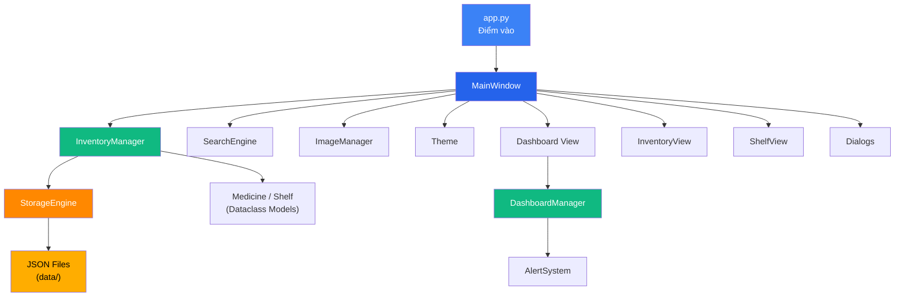
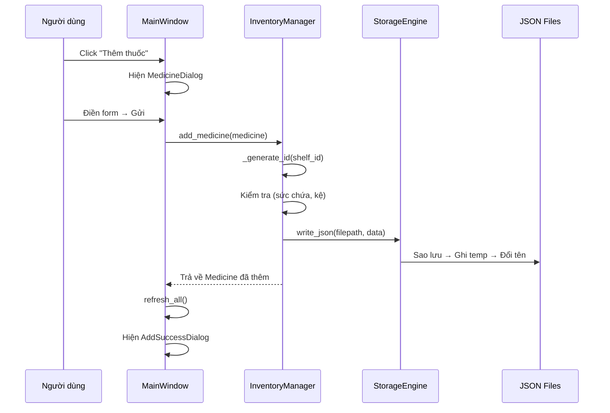
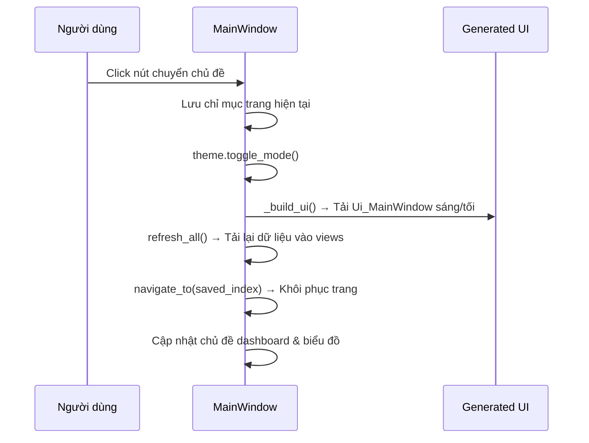

# 💊 PHARMA.SYS — Project Context

> **Dự án:** Hệ Thống Quản Lý Kho Thuốc  
> **Phiên bản:** 1.0.0 Beta  
> **Môn học:** Kỹ Thuật Lập Trình — Nhóm 3  
> **Ngày cập nhật context:** 26/03/2026 (cập nhật lần 6 — đồng bộ cấu trúc thư mục thực tế)

---

## 1. Tổng Quan

Ứng dụng desktop **quản lý kho thuốc** (Pharmacy Inventory Management) xây dựng bằng **Python + PyQt6**, hỗ trợ:

- CRUD thuốc & kệ thuốc
- Cảnh báo hết hạn / sắp hết hạn / tồn kho thấp / hết hàng
- Tìm kiếm mờ (fuzzy search) bằng TheFuzz
- Dashboard thống kê với biểu đồ Matplotlib
- Chế độ Light / Dark mode (giữ nguyên trang hiện tại khi chuyển theme)
- Lưu trữ dữ liệu bằng JSON files với cơ chế atomic write + backup

---

## 2. Tech Stack

| Thành phần       | Công nghệ                      |
|------------------|--------------------------------|
| Ngôn ngữ         | Python 3.13+                   |
| UI Framework     | PyQt6 ≥ 6.6.0                  |
| Charts           | Matplotlib ≥ 3.8.0             |
| Fuzzy Search     | TheFuzz ≥ 0.22.0 + python-Levenshtein |
| Data Storage     | JSON files (atomic writes)     |
| UI Design        | Qt Designer (.ui files)        |
| Testing          | pytest (~152 tests)            |

---

## 3. Cấu Trúc Thư Mục

```
KiThuatLapTrinhNhom3/
├── app.py                      # 🚀 Điểm vào (QApplication setup)
├── requirements.txt            # Các phụ thuộc
├── run.bat                     # Script khởi chạy Windows
├── run_tests.bat               # Script chạy test
│
├── src/                        # 📦 Mã nguồn
│   ├── __init__.py             # Xuất package (Medicine, Shelf, v.v.)
│   ├── models.py               # Model dữ liệu: Medicine, Shelf
│   ├── storage.py              # StorageEngine: đọc/ghi JSON nguyên tử
│   ├── inventory_manager.py    # InventoryManager: CRUD, validate, sắp xếp
│   ├── alerts.py               # AlertSystem: cảnh báo hết hạn & tồn kho
│   ├── search_engine.py        # SearchEngine: tìm kiếm mờ
│   ├── image_manager.py        # ImageManager: ảnh thuốc
│   ├── dashboard_manager.py    # DashboardManager: xử lý dữ liệu dashboard
│   │
│   ├── views/                  # 📊 Các trang chính (CHỈ UI)
│   │   ├── __init__.py         # Xuất Dashboard, InventoryView, ShelfView
│   │   ├── dashboard.py        # Giao diện dashboard (render thẻ KPI + biểu đồ)
│   │   ├── inventory_view.py   # Bảng danh sách thuốc
│   │   └── shelf_view.py       # Trang quản lý kệ
│   │
│   ├── dialogs/                # 💬 Các hộp thoại
│   │   ├── __init__.py         # Xuất tất cả dialog
│   │   ├── medicine_dialog.py      # Thêm/Sửa thuốc
│   │   ├── shelf_dialog.py         # Thêm/Sửa kệ
│   │   ├── filter_dialog.py        # Lọc thuốc
│   │   ├── medicine_detail_view.py # Xem chi tiết thuốc
│   │   └── notification_dialogs.py # Thông báo thành công/lỗi/xác nhận
│   │
│   └── ui/                     # 🎨 Giao diện người dùng
│       ├── __init__.py          # Xuất các thành phần UI
│       ├── main_window.py       # MainWindow + SearchDialog (chỉ logic xử lý)
│       │
│       ├── theme/               # 🎨 Hệ thống chủ đề (tách module)
│       │   ├── __init__.py      # Xuất Theme, ThemeMode
│       │   ├── colors.py        # Bảng màu Light/Dark
│       │   ├── tokens.py        # Khoảng cách, bo góc, font chữ
│       │   ├── sidebar.py       # Hằng số sidebar
│       │   ├── cards.py         # Màu thẻ thống kê & biểu đồ
│       │   ├── core.py          # Lớp Theme, enum ThemeMode
│       │   ├── stylesheets.py   # Tạo stylesheet Qt
│       │   └── badges.py        # Hàm trợ giúp huy hiệu/cảnh báo
│       │
│       └── generated/           # ⚠️ TỰ ĐỘNG SINH — KHÔNG CHỈNH SỬA
│           ├── main_window_ui.py      # Giao diện chính (sáng)
│           ├── main_window_ui_dark.py # Giao diện chính (tối)
│           ├── search.py / search_dark.py
│           ├── loc_thuoc.py / loc_thuoc_dark.py
│           ├── ke_day.py
│           ├── them_thuoc.py / them_thuoc_dark.py
│           ├── them_ke.py / them_ke_dark.py
│           ├── them_thanh_cong.py / them_thanh_cong_dark.py
│           ├── sua_thanh_cong.py / sua_thanh_cong_dark.py
│           ├── xac_nhan_xoa.py / xac_nhan_xoa_dark.py
│           ├── xoa_thanh_cong.py / xoa_thanh_cong_dark.py
│           └── thong_tin_thuoc.py / thong_tin_thuoc_dark.py
│
├── data/                       # 💾 Lưu trữ dữ liệu
│   ├── medicines.json           # CSDL thuốc
│   ├── medicines.json.backup    # Sao lưu tự động
│   ├── shelves.json             # CSDL kệ
│   ├── shelves.json.backup      # Sao lưu tự động
│   ├── settings.json            # Cài đặt (theme, ngưỡng)
│   └── images/                  # Ảnh thuốc
│
├── tests/                      # 🧪 Unit tests
│   ├── test_models.py
│   ├── test_storage.py
│   ├── test_inventory.py
│   ├── test_alerts.py
│   ├── test_search.py
│   └── test_image_manager.py
│
├── docs/                       # 📚 Tài liệu
│   ├── PROGRESS.md
│   ├── QUICKSTART.md
│   ├── SCREENSHOTS.md
│   ├── SUMMARY.md
│   ├── classflow.md
│   ├── projectcharts.md
│   ├── design_guideline.md
│   └── classDiagram.drawio.png
│
├── design-ui/                  # 🎨 Tài sản thiết kế
│   ├── PHARMA_SYS_Color_System.md
│   ├── Structure.md
│   ├── guideline.md
│   ├── ui_flow.md
│   └── design-ui/Qt_designer/  # File .ui & Logo.png
│
└── Ui Qt/                      # File .ui gốc Qt Designer (cặp Sáng + Tối)
    ├── main_window.ui / main_window_dark.ui
    ├── them_thuoc.ui / them_thuoc_dark.ui
    ├── them_ke.ui / them_ke_dark.ui
    ├── loc_thuoc.ui / loc_thuoc_dark.ui
    ├── search.ui / search_dark.ui
    ├── them_thanh_cong.ui / them_thanh_cong_dark.ui
    ├── sua_thanh_cong.ui / sua_thanh_cong_dark.ui
    ├── xac_nhan_xoa.ui / xac_nhan_xoa_dark.ui
    ├── xoa_thanh_cong.ui / xoa_thanh_cong_dark.ui
    ├── thong_tin_thuoc.ui / thong_tin_thuoc_dark.ui
    └── ke_day.ui
```

> [!WARNING]
> **Không chỉnh sửa** files trong `src/ui/generated/` — chúng được sinh tự động bởi `pyuic6` và sẽ bị ghi đè.

---

## 4. Data Models

### Medicine ([models.py](file:///c:/Users/Desired/Desktop/ki2nam2/kithuatlaptrinh/DoAnKiThuatLaptrinh/KiThuatLapTrinhNhom3/src/models.py#L13-L101))

```python
@dataclass
class Medicine:
    id: str            # Định dạng: "{shelf_id}.{seq:03d}" (VD: "K-A1.001")
    name: str          # Tên thuốc
    quantity: int      # Số lượng (≥ 0)
    expiry_date: date  # Hạn sử dụng
    shelf_id: str      # FK → Shelf.id
    price: float       # Giá (≥ 0)
    image_path: str    # Đường dẫn tương đối tới ảnh
```

**Phương thức quan trọng:**
- `is_expired()` → bool: so sánh `expiry_date` với `date.today()`
- `days_until_expiry()` → int: số ngày còn lại (âm = đã hết hạn)
- `to_dict()` / `from_dict()`: chuyển đổi JSON

### Shelf ([models.py](file:///c:/Users/Desired/Desktop/ki2nam2/kithuatlaptrinh/DoAnKiThuatLaptrinh/KiThuatLapTrinhNhom3/src/models.py#L104-L157))

```python
@dataclass
class Shelf:
    id: str        # Định dạng: "{zone}-{column}{row}" (VD: "K-A1")
    zone: str      # Khu, VD: "K"
    column: str    # Cột, VD: "A"
    row: str       # Dãy, VD: "1"
    capacity: str  # Sức chứa tối đa
```

---

## 5. Kiến Trúc & Design Patterns



### Patterns sử dụng:

| Pattern | Mô tả |
|---------|--------|
| **MVC** | Models (`models.py`) — Views (`ui/views/`, `ui/dialogs/`) — Controller (`inventory_manager.py`, `dashboard_manager.py`) |
| **Repository** | `StorageEngine` trừu tượng hóa file I/O |
| **Immutable Update** | `update_medicine()` tạo object mới thay vì mutate |
| **Atomic Write** | Ghi file qua temp → rename, có backup recovery |
| **Signal/Slot** | Hệ thống sự kiện Qt cho giao tiếp UI |
| **Observer** | Dashboard + InventoryView lắng nghe sự thay đổi data |
| **Dual UI Generation** | Mỗi dialog/window có 2 phiên bản generated (sáng + tối), chọn tại runtime |

---

## 6. Business Logic

### InventoryManager ([inventory_manager.py](file:///c:/Users/Desired/Desktop/ki2nam2/kithuatlaptrinh/DoAnKiThuatLaptrinh/KiThuatLapTrinhNhom3/src/inventory_manager.py))

Bộ điều khiển trung tâm cho tất cả thao tác CRUD:

| Method | Chức năng |
|--------|-----------|
| `load_data()` | Tải thuốc & kệ từ JSON |
| `save_data()` / `save_shelves()` | Lưu dữ liệu nguyên tử |
| `add_medicine(med)` | Thêm thuốc, tự tạo ID, kiểm tra sức chứa |
| `update_medicine(id, changes)` | Cập nhật (bất biến), tạo lại ID nếu đổi kệ |
| `remove_medicine(id)` | Xóa thuốc |
| `sort_medicines(field, asc)` | Sắp xếp theo id/name/quantity/expiry_date/price |
| `add_shelf() / update_shelf() / remove_shelf()` | CRUD kệ |
| `get_shelf_remaining_capacity()` | Tính sức chứa còn lại |

**Logic tạo ID:**
- Định dạng: `{shelf_id}.{seq:03d}` → VD: `K-A1.001`, `K-A1.002`
- Khi đổi kệ → tự động sinh ID mới theo kệ mới

### AlertSystem ([alerts.py](file:///c:/Users/Desired/Desktop/ki2nam2/kithuatlaptrinh/DoAnKiThuatLaptrinh/KiThuatLapTrinhNhom3/src/alerts.py))

| Loại cảnh báo | Điều kiện | Mức độ |
|------------|-----------|------------|
| `EXPIRED` | `expiry_date <= today` | 3 (cao) |
| `EXPIRING_SOON` | `days_until_expiry <= 30` và chưa hết hạn | 2 |
| `OUT_OF_STOCK` | `quantity == 0` | 3 (cao) |
| `LOW_STOCK` | `quantity <= 5` và `> 0` | 1 (thấp) |

### SearchEngine ([search_engine.py](file:///c:/Users/Desired/Desktop/ki2nam2/kithuatlaptrinh/DoAnKiThuatLaptrinh/KiThuatLapTrinhNhom3/src/search_engine.py))

- Khớp mờ bằng `thefuzz.fuzz.ratio()` + `partial_ratio()`
- Lấy điểm cao nhất giữa 2 phương pháp
- Ngưỡng mặc định: **70%** điểm khớp
- Hỗ trợ: `search()`, `search_by_name()`, `get_suggestions()`

### ImageManager ([image_manager.py](file:///c:/Users/Desired/Desktop/ki2nam2/kithuatlaptrinh/DoAnKiThuatLaptrinh/KiThuatLapTrinhNhom3/src/image_manager.py))

- Lưu ảnh vào `data/images/` với tên = medicine ID
- Kiểm tra: định dạng (.png, .jpg, .jpeg, .bmp, .webp) + kích thước (tối đa 5MB)
- Tự đổi tên ảnh khi thuốc thay đổi kệ (ID thay đổi)

### DashboardManager ([dashboard_manager.py](file:///c:/Users/Desired/Desktop/ki2nam2/kithuatlaptrinh/DoAnKiThuatLaptrinh/KiThuatLapTrinhNhom3/src/dashboard_manager.py))

Bộ xử lý dữ liệu trung tâm cho trang Dashboard. Tách toàn bộ logic nghiệp vụ khỏi tầng view.

| Method | Chức năng |
|--------|-----------|
| `get_statistics(medicines)` | Tính thống kê KPI (tổng, hết hạn, sắp hết hạn, tồn kho thấp) |
| `get_pie_chart_data(medicines)` | Chuẩn bị dữ liệu biểu đồ tròn (phân loại thuốc) |
| `get_bar_chart_data(medicines)` | Chuẩn bị dữ liệu biểu đồ cột (top N thuốc theo số lượng) |
| `get_expiring_medicines(medicines)` | Lọc danh sách thuốc sắp hết hạn |
| `get_low_stock_medicines(medicines)` | Lọc danh sách thuốc tồn kho thấp |

**Dataclass trung gian:**
- `DashboardStats` — Các chỉ số KPI
- `PieChartData` — Dữ liệu biểu đồ tròn (sizes, labels, colors)
- `BarChartData` — Dữ liệu biểu đồ cột (names, quantities)
- `ExpiryItem` — Mục thuốc sắp hết hạn (name, expiry_date, days_left)
- `LowStockItem` — Mục thuốc tồn kho thấp (name, shelf_id, quantity)

---

## 7. Thành Phần UI

### MainWindow ([main_window.py](file:///c:/Users/Desired/Desktop/ki2nam2/kithuatlaptrinh/DoAnKiThuatLaptrinh/KiThuatLapTrinhNhom3/src/ui/main_window.py))

Layout chính dùng generated UI từ `src/ui/generated/main_window_ui.py` (Sáng) hoặc `main_window_ui_dark.py` (Tối).
`main_window.py` chỉ chứa **logic xử lý** — không định nghĩa widget thủ công.

```
┌──────────────────────────────────────────┐
│ ┌──────────┐ ┌─────────────────────────┐ │
│ │          │ │ Header: Title │ 🔍 │ 🌙 │ │
│ │ Sidebar  │ ├─────────────────────────┤ │
│ │          │ │                         │ │
│ │ Dashboard│ │    QStackedWidget       │ │
│ │ Inventory│ │  (Dashboard/Inventory/  │ │
│ │ Shelves  │ │   Shelves)              │ │
│ │ Report   │ │                         │ │
│ │ Setting  │ │                         │ │
│ │          │ │                         │ │
│ └──────────┘ └─────────────────────────┘ │
└──────────────────────────────────────────┘
```

**Tiêu đề cửa sổ:** `KTLT_Nhom3_QuanLyKhoThuoc` (định nghĩa trong `Ui Qt/main_window.ui`, compile bằng `pyuic6`)

**3 trang (QStackedWidget):**
- `PAGE_DASHBOARD = 0` → Dashboard
- `PAGE_INVENTORY = 1` → InventoryView
- `PAGE_SHELVES = 2` → ShelfView

**Phím tắt:**
- `Ctrl+K` → Hộp thoại tìm kiếm

**Chuyển đổi chủ đề (giữ trang):**
- Khi chuyển theme, `toggle_theme()` lưu `currentIndex()` **trước khi** rebuild UI
- Sau khi `_build_ui()` + `refresh_all()`, gọi `navigate_to(saved_index, btn)` để khôi phục trang đang xem
- Đảm bảo người dùng không bị nhảy về Dashboard khi chuyển Light ↔ Dark

### InventoryView ([inventory_view.py](file:///c:/Users/Desired/Desktop/ki2nam2/kithuatlaptrinh/DoAnKiThuatLaptrinh/KiThuatLapTrinhNhom3/src/views/inventory_view.py))

Bảng danh sách thuốc với các tính năng:
- Nút **`+ Thêm thuốc`** (`objectName=btn_add_medicine`) phát signal `add_requested` → kết nối với `MainWindow.show_add_medicine()`
- Nút **Lọc** → phát `filter_requested`
- Nút **Xóa lọc** → ẩn theo mặc định, hiện khi có bộ lọc đang hoạt động
- Menu ngữ cảnh (chuột phải) → Chỉnh sửa / Xóa thuốc
- Double-click hàng → xem chi tiết thuốc
- Màu chữ theo trạng thái (không tô màu nền hàng — chỉ thay màu text)

**Signals:**
```python
add_requested    = pyqtSignal()    # Thêm thuốc mới
edit_requested   = pyqtSignal(str) # Chỉnh sửa (medicine_id)
delete_requested = pyqtSignal(str) # Xóa (medicine_id) → MainWindow xử lý xác nhận
detail_requested = pyqtSignal(str) # Xem chi tiết
filter_requested = pyqtSignal()    # Mở hộp thoại lọc
```

**Lưu ý xóa thuốc:** `InventoryView.confirm_delete()` chỉ phát `delete_requested`, **không** tự hiện dialog xác nhận. `ConfirmDeleteDialog` được hiển thị bởi `MainWindow.delete_medicine()`.

### Các Dialog quan trọng:

| Dialog | File | Chức năng |
|--------|------|-----------|
| `MedicineDialog` | [medicine_dialog.py](file:///c:/Users/Desired/Desktop/ki2nam2/kithuatlaptrinh/DoAnKiThuatLaptrinh/KiThuatLapTrinhNhom3/src/dialogs/medicine_dialog.py) | Thêm/Sửa thuốc (dùng `them_thuoc` / `them_thuoc_dark` generated UI) |
| `ShelfDialog` | [shelf_dialog.py](file:///c:/Users/Desired/Desktop/ki2nam2/kithuatlaptrinh/DoAnKiThuatLaptrinh/KiThuatLapTrinhNhom3/src/dialogs/shelf_dialog.py) | Thêm/Sửa kệ (dùng `them_ke` / `them_ke_dark` generated UI) |
| `SearchDialog` | main_window.py (nội tuyến) | Tìm kiếm mờ (dùng `search` / `search_dark` generated UI) |
| `FilterMedicineDialog` | [filter_dialog.py](file:///c:/Users/Desired/Desktop/ki2nam2/kithuatlaptrinh/DoAnKiThuatLaptrinh/KiThuatLapTrinhNhom3/src/dialogs/filter_dialog.py) | Lọc thuốc (dùng `loc_thuoc` / `loc_thuoc_dark` generated UI) |
| `MedicineDetailView` | [medicine_detail_view.py](file:///c:/Users/Desired/Desktop/ki2nam2/kithuatlaptrinh/DoAnKiThuatLaptrinh/KiThuatLapTrinhNhom3/src/dialogs/medicine_detail_view.py) | Xem chi tiết thuốc (dùng `thong_tin_thuoc` / `thong_tin_thuoc_dark`) |
| Notification Dialogs | [notification_dialogs.py](file:///c:/Users/Desired/Desktop/ki2nam2/kithuatlaptrinh/DoAnKiThuatLaptrinh/KiThuatLapTrinhNhom3/src/dialogs/notification_dialogs.py) | Thêm/Sửa/Xóa thành công, Xác nhận xóa, Kệ đầy |

---

## 8. Hệ Thống Chủ Đề

### [theme/](file:///c:/Users/Desired/Desktop/ki2nam2/kithuatlaptrinh/DoAnKiThuatLaptrinh/KiThuatLapTrinhNhom3/src/ui/theme/)

Hệ thống chủ đề đã được tách thành package gồm 7 module:

| Module | Nội dung |
|--------|----------|
| `colors.py` | Bảng màu `LIGHT_COLORS` và `DARK_COLORS` |
| `tokens.py` | Khoảng cách, bo góc, font chữ |
| `sidebar.py` | Hằng số sidebar (cố định cả 2 mode) |
| `cards.py` | Màu thẻ thống kê & biểu đồ |
| `core.py` | Lớp `Theme`, enum `ThemeMode` |
| `stylesheets.py` | Hàm tạo stylesheet Qt |
| `badges.py` | Hàm trợ giúp huy hiệu/cảnh báo |

| Thuộc tính | Chế độ Sáng | Chế độ Tối |
|------------|------------|-----------|
| Background | `#F4F6F8` | `#1F2933` |
| Surface | `#FFFFFF` | `#273947` |
| Table row alt | `#F8F9FB` | `#2D3F4F` |
| Primary | `#2563EB` | `#2563EB` |
| Text Primary | `#2F3E46` | `#E4E7EB` |
| Border | `#E0E6ED` | `#3E4C59` |
| Sidebar BG | `#1C2944` (cố định cả 2 mode) | |

**Design tokens:**
- Khoảng cách: lưới 8px
- Bo góc: 8px (dạng viên: 10px)
- Font: Segoe UI / Inter, sans-serif
- Cỡ chữ: H1=20, H2=16, Body=14, Table=13, Caption=12, Badge=11

**Màu thẻ thống kê:** Xanh (`#3B82F6`), Cam (`#FF8800`), Đỏ (`#EF4444`), Vàng (`#FFAD00`)

**Cách tiếp cận Dual UI:**
- Mỗi form/dialog có 2 file `.ui` (sáng + tối) trong `Ui Qt/`
- Compile bằng `pyuic6` thành 2 file `.py` trong `src/ui/generated/`
- Tại runtime, logic xử lý chọn đúng class generated dựa trên `theme.mode`

**Ghi chú stylesheet (sửa lỗi Dark Mode):**
- `QTableWidget` có `alternate-background-color: {table_row_alt}` — tránh Qt dùng màu trắng hệ thống
- `QMenu::item` có `color: {text_primary}` — tránh chữ chìm trong context menu dark mode

---

## 9. Luồng Dữ Liệu



### Luồng Chuyển Đổi Chủ Đề



---

## 10. Cài Đặt

File: [data/settings.json](file:///c:/Users/Desired/Desktop/ki2nam2/kithuatlaptrinh/DoAnKiThuatLaptrinh/KiThuatLapTrinhNhom3/data/settings.json)

```json
{
    "theme": "light",
    "expiry_threshold": 30,
    "low_stock_threshold": 5,
    "language": "vi"
}
```

---

## 11. Kiểm Thử

Chạy tests: `pytest tests/ -v`

| File Test | Phạm vi |
|-----------|---------|
| `test_models.py` | Dataclass Medicine & Shelf, kiểm tra, chuyển đổi dữ liệu |
| `test_storage.py` | Ghi nguyên tử, sao lưu/phục hồi, xử lý file hỏng |
| `test_inventory.py` | Thao tác CRUD, tạo ID, kiểm tra sức chứa |
| `test_alerts.py` | Cảnh báo hết hạn/tồn kho, sắp xếp theo mức độ |
| `test_search.py` | Khớp mờ, ngưỡng, gợi ý |
| `test_image_manager.py` | CRUD ảnh, kiểm tra, đổi tên |

**Tổng: ~152 tests**

---

## 12. Chạy Ứng Dụng

```bash
# Cài đặt
pip install -r requirements.txt

# Chạy app
python app.py

# Hoặc dùng script Windows
run.bat
```

---

## 13. Lưu Ý Quan Trọng

> [!CAUTION]
> - **KHÔNG chỉnh sửa** files trong `src/ui/generated/` — được sinh bởi `pyuic6`
> - Sau khi sửa file `.ui` trong `Ui Qt/`, phải chạy lại: `.venv/Scripts/pyuic6.exe "Ui Qt/main_window.ui" -o "src/ui/generated/main_window_ui.py"`

> [!NOTE]
> - Logo nằm tại: `design-ui/design-ui/Qt_designer/Logo.png`
> - Sidebar background (`#1C2944`) giữ nguyên cho cả chế độ Sáng và Tối
> - Medicine ID tự động thay đổi khi chuyển kệ (shelf)
> - StorageEngine tự sao lưu trước khi ghi, tự phục hồi khi file bị hỏng
> - Tiêu đề cửa sổ được định nghĩa trong `Ui Qt/main_window.ui` → compiled vào `main_window_ui.py`
> - Chuyển đổi chủ đề giữ nguyên trang hiện tại (page index) — không nhảy về Dashboard

> [!IMPORTANT]
> - Kiểm tra sức chứa: khi thêm/sửa thuốc, hệ thống kiểm tra sức chứa còn lại của kệ
> - sort_medicines() trả về **bản sao**, không thay đổi list gốc
> - `Shelf.capacity` đang lưu kiểu `str` (cần cast int khi tính toán)
> - **Phân tách module UI:** `views/` và `dialogs/` nằm ở `src/views/` và `src/dialogs/` (import: `from src.views.xxx` / `from src.dialogs.xxx`), **không phải** `src.ui.views` hay `src.ui.dialogs`
> - `src/ui/` chỉ chứa: `main_window.py`, `theme/`, `generated/`
> - Mỗi dialog/form cần **2 generated files** (sáng + tối) — khi thêm UI mới phải tạo cả 2 phiên bản
> - Hệ thống theme: import qua `from src.ui.theme import Theme, ThemeMode`
> - `InventoryView.confirm_delete()` chỉ phát signal — `ConfirmDeleteDialog` do `MainWindow.delete_medicine()` khởi tạo
