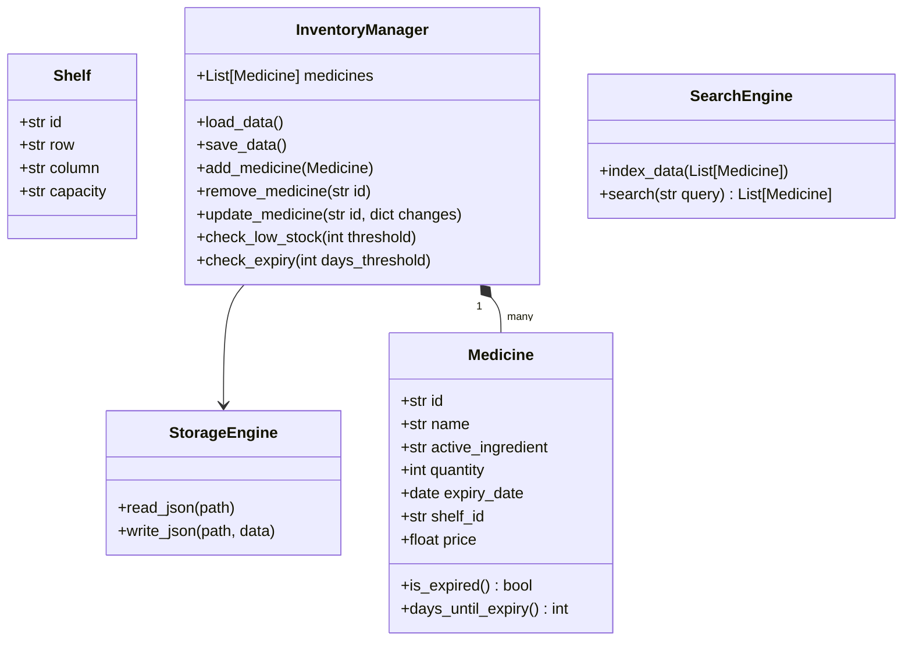
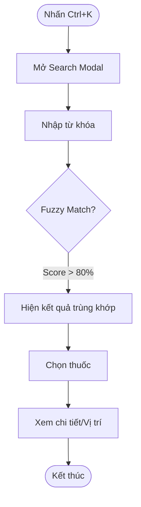

# Pharmacy Management System - Tài liệu Thiết kế

## 1. Tổng quan Dự án
**Mục tiêu:** Xây dựng ứng dụng desktop cho dược sĩ để quản lý kho, kiểm tra tồn kho và theo dõi hạn sử dụng thuốc.
**Đối tượng sử dụng:** Dược sĩ (Nội bộ).
**Tech Stack:**
-   **Ngôn ngữ:** Python 3.10+
-   **GUI:** PyQt6 (Giao diện hiện đại, Responsive, hỗ trợ Dark/Light mode)
-   **Xử lý dữ liệu:** Pandas (hoặc Polars để tối ưu hiệu năng) + Numpy
-   **Lưu trữ:** Pure JSON files (Không sử dụng Database)
-   **Tìm kiếm:** Fuzzy Search (TheFuzz/RapidFuzz)
-   **Biểu đồ:** Matplotlib

## 2. Kiến trúc Hệ thống (Structure Chart)

```mermaid
graph TD
    App[Main Application] --> UI[UI Layer (PyQt6)]
    App --> Logic[Business Logic]
    App --> Data[Data Access Layer]

    UI --> Dashboard[Dashboard View]
    UI --> InventoryView[Inventory View]
    UI --> SearchBar[Global Search (Ctrl+K)]
    UI --> Reports[Reports (Matplotlib)]

    Logic --> InvMgr[Inventory Manager]
    Logic --> SearchEng[Search Engine]
    Logic --> AlertSys[Expiry Alert System]

    Data --> JSON_Store[JSON Storage Engine]
    Data --> Models[Data Models]

    InvMgr --> Models
    SearchEng --> Models
    JSON_Store --> Files[(JSON Files)]
```

## 3. Thiết kế Dữ liệu & Class Diagram

### Data Models
Sử dụng Python `dataclasses` cho các model, serialize sang JSON.



## 4. Các luồng xử lý chính (Flowcharts)

### 4.1. Import/Thêm thuốc mới
```mermaid
flowchart LR
    Start([Bắt đầu]) --> Input[Điền form (Tên, SL, HSD, Vị trí)]
    Input --> Validate{Dữ liệu hợp lệ?}
    Validate -- Không --> Error[Hiện lỗi] --> Input
    Validate -- Có --> UpdateObj[Tạo Object Medicine]
    UpdateObj --> Save[Lưu vào JSON]
    Save --> UI_Update[Cập nhật bảng hiển thị]
    UI_Update --> End([Kết thúc])
```

### 4.2. Tìm kiếm toàn cục (Ctrl+K)


## 5. Chiến lược UI/UX
-   **Theme:** Modern Flat Design sử dụng `Breeze` hoặc `Qt-Material` (tùy chỉnh qua CSS/QSS).
-   **Phím tắt:**
    -   `Ctrl+K`: Tìm kiếm nhanh (Global Search).
    -   `Ctrl+N`: Thêm thuốc mới.
    -   `Ctrl+D`: Chuyển đổi Dark/Light Mode.
-   **Layout:**
    -   **Sidebar:** Điều hướng (Dashboard, Kho thuốc, Báo cáo, Cài đặt).
    -   **Main Area:** Nội dung chính thay đổi động.
    -   **Status Bar:** Tổng số thuốc, cảnh báo.

## 6. Báo cáo (Tích hợp Matplotlib)
Widget `ReportWidget` sẽ nhúng biểu đồ Matplotlib vào PyQt6 canvas.
**Các biểu đồ dự kiến:**
1.  **Phân bố hạn sử dụng (Pie Chart):** Tốt vs. Cận date (<30 ngày) vs. Hết hạn.
2.  **Mức tồn kho (Bar Chart):** Top 10 thuốc có số lượng cao nhất.
3.  **Sức chứa tủ kệ (Heatmap - Optional):** Trực quan hóa độ đầy của kệ thuốc.
