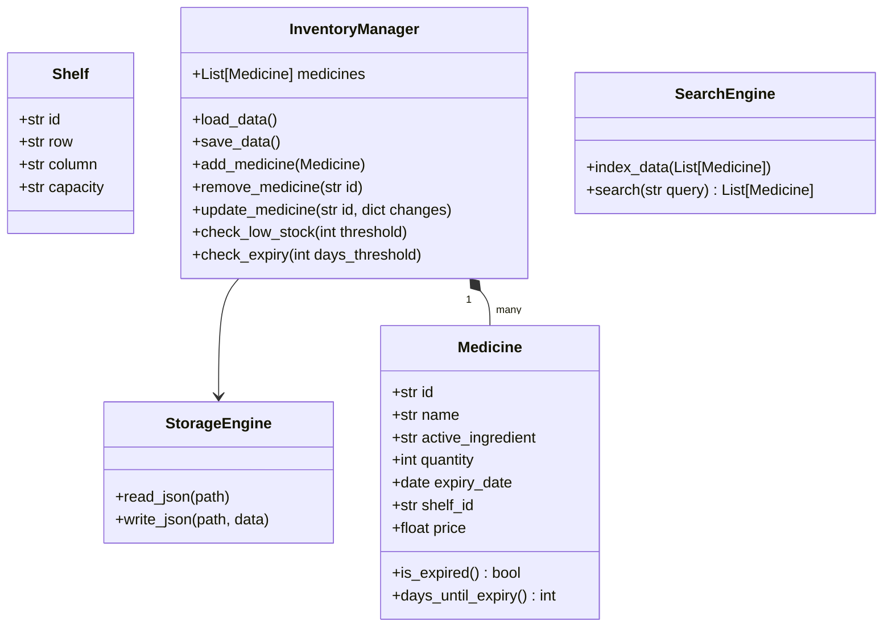
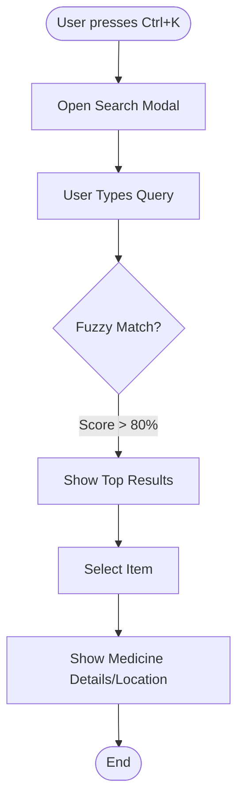

# Pharmacy Management System - Design Document

## 1. Project Overview
**Goal:** A desktop application for pharmacists to manage inventory, check stock, and monitor expiry dates.
**Target Users:** Pharmacists (Internal use only).
**Tech Stack:**
-   **Language:** Python 3.10+
-   **GUI:** PyQt6 (Modern, Responsive, Dark/Light mode)
-   **Data Processing:** Pandas (or Polars for performance) + Numpy
-   **Storage:** Pure JSON files (No Database)
-   **Search:** Fuzzy Search (TheFuzz/RapidFuzz)
-   **Visuals:** Matplotlib for reporting

## 2. System Architecture (Structure Chart)

```mermaid
graph TD
    App[Main Application] --> UI[UI Layer (PyQt6)]
    App --> Logic[Business Logic]
    App --> Data[Data Access Layer]

    UI --> Dashboard[Dashboard View]
    UI --> InventoryView[Inventory View]
    UI --> SearchBar[Global Search (Ctrl+K)]
    UI --> Reports[Reports (Matplotlib)]

    Logic --> InvMgr[Inventory Manager]
    Logic --> SearchEng[Search Engine]
    Logic --> AlertSys[Expiry Alert System]

    Data --> JSON_Store[JSON Storage Engine]
    Data --> Models[Data Models]

    InvMgr --> Models
    SearchEng --> Models
    JSON_Store --> Files[(JSON Files)]
```

## 3. Data Design & Class Diagram

### Data Models
We will use Python Dataclasses for models, serialized to JSON.



## 4. Key Flows (Flowcharts)

### 4.1. Import/Add Medicine
```mermaid
flowchart LR
    Start([Start]) --> Input[Fill Form (Name, Qty, Expiry, Shelf)]
    Input --> Validate{Validate Data?}
    Validate -- No --> Error[Show Error] --> Input
    Validate -- Yes --> UpdateObj[Create Medicine Object]
    UpdateObj --> Save[Save to JSON]
    Save --> UI_Update[Update Table View]
    UI_Update --> End([End])
```

### 4.2. Global Search (Ctrl+K)


## 5. UI/UX Strategy
-   **Theme:** Modern Flat Design using `Breeze` or `Qt-Material` themes (customizable via CSS/QSS).
-   **Shortcuts:**
    -   `Ctrl+K`: Global Search.
    -   `Ctrl+N`: Add new medicine.
    -   `Ctrl+D`: Toggle Dark/Light Mode.
-   **Layout:**
    -   **Sidebar:** Navigation (Dashboard, Inventory, Reports, Settings).
    -   **Main Area:** Dynamic content.
    -   **Status Bar:** Total items, alerts.

## 6. Reporting (Matplotlib Integration)
The `ReportWidget` will embed Matplotlib figures into PyQt6 canvas.
**Planned Charts:**
1.  **Expiry Distribution (Pie Chart):** Good vs. Near Expiry (<30 days) vs. Expired.
2.  **Stock Levels (Bar Chart):** Top 10 items by quantity.
3.  **Shelf Utilization (Heatmap - Optional):** Visual representation of shelf fullness.
