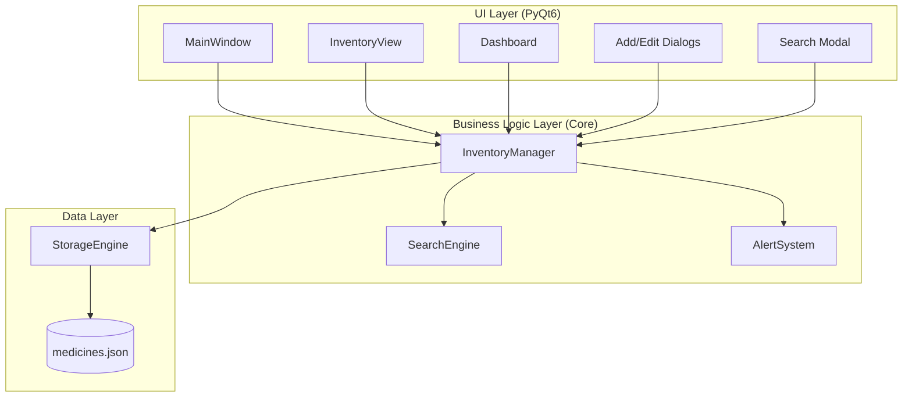
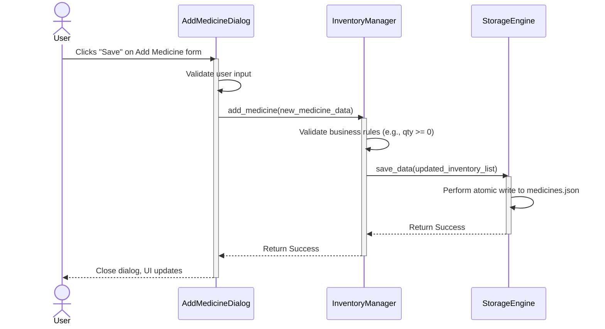
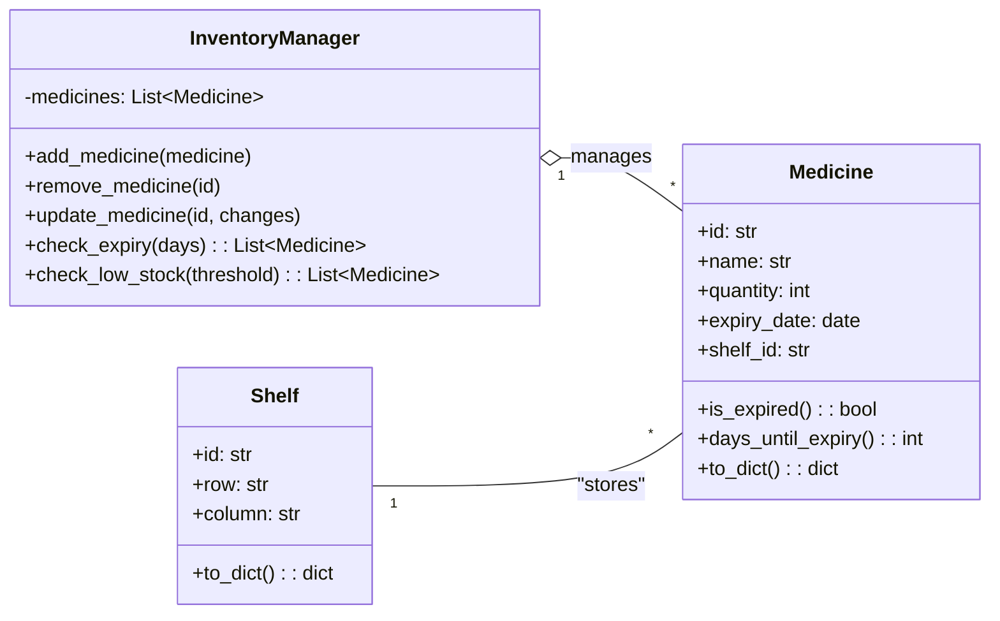
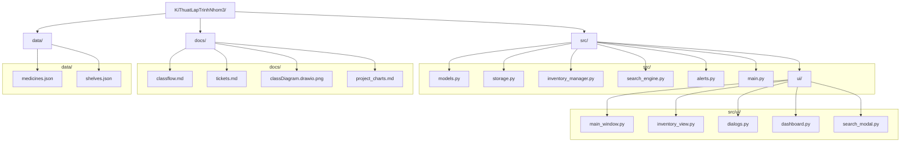

# Project Documentation Charts

This document outlines key architectural and flow diagrams for the Pharmacy Management System, providing a visual overview of its structure and functionality. These diagrams are generated using Mermaid syntax, which can be rendered by many Markdown viewers and documentation tools.

---

### 1. Component Architecture Diagram

**Why it's needed:** This high-level diagram illustrates the main software components, their organization into layers (UI, Business Logic, Data), and their primary interactions. It helps developers quickly understand the overall design and interdependencies of the system.

---

### 2. Logic Flow / Sequence Diagram (for a Key Use Case)

**Why it's needed:** This diagram demonstrates the dynamic interaction between different components over time to complete a specific task. It's particularly useful for detailing "How the code runs" for a key feature, such as adding a new medicine, showing the sequence of calls between the UI, business logic, and data layers.

---

### 3. Class Diagram

**Why it's needed:** A class diagram describes the static structure of the project's data models. It defines the core objects (classes) like `Medicine` and `Shelf`, their attributes (properties), their methods (functions), and the relationships (associations, aggregations) between them. This serves as a blueprint for the data and object-oriented design.

---

### 4. File Structure Diagram

**Why it's needed:** This diagram provides a visual representation of the project's directory and file organization. It's crucial for understanding where different parts of the code and data reside, aiding navigation and maintenance. It also clarifies the separation of concerns within the project.

