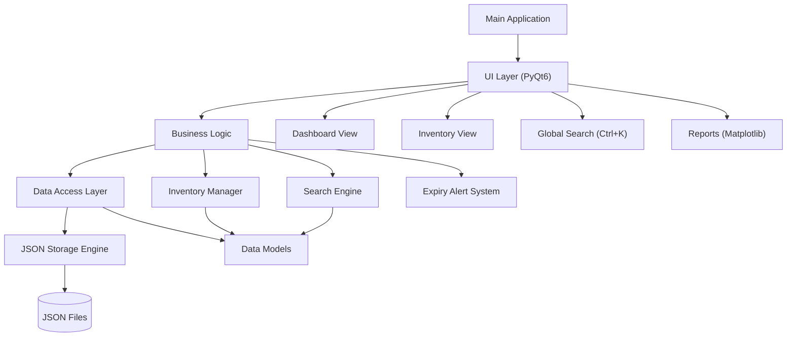
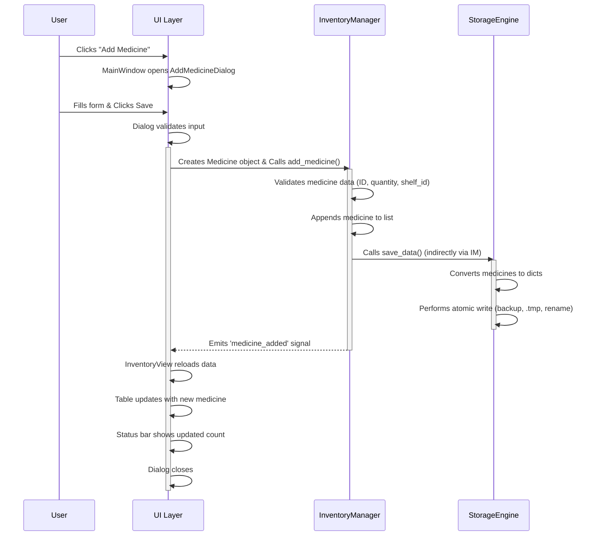
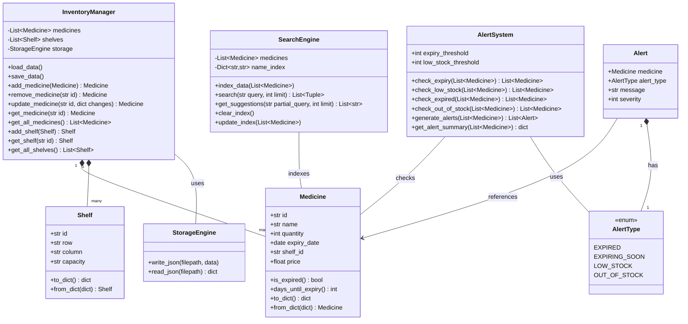
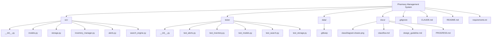

# Sơ đồ dự án: Hệ thống Quản lý Nhà thuốc

Tài liệu này trình bày các sơ đồ kiến trúc và sơ đồ luồng chính cho Hệ thống Quản lý Nhà thuốc, cung cấp một cái nhìn tổng quan trực quan về cấu trúc và chức năng của nó. Các sơ đồ này được tạo bằng cú pháp Mermaid, có thể được hiển thị bởi nhiều trình xem Markdown và công cụ tài liệu.

---

## 1. Sơ đồ Kiến trúc Thành phần

Sơ đồ này minh họa tổ chức cấp cao của Hệ thống Quản lý Nhà thuốc thành các lớp và thành phần riêng biệt, thể hiện các mối quan hệ và sự phụ thuộc chính của chúng.

### Giải thích:
-   **Main Application:** Đóng vai trò khởi tạo (bootstrap) hệ thống.
-   **UI Layer (PyQt6):** Xử lý tương tác người dùng và hiển thị thông tin. Gọi các chức năng từ lớp Business Logic. Gồm các chế độ xem như Dashboard, Inventory View, Global Search và Reports.
-   **Business Logic Layer:** Chứa các quy tắc nghiệp vụ và hoạt động cốt lõi, được quản lý bởi Inventory Manager, Search Engine và Alert System.
-   **Data Access Layer:** Chịu trách nhiệm về việc lưu trữ và truy cập dữ liệu, bao gồm JSON Storage Engine và các Data Models (Medicine, Shelf).
-   **Dependencies:** Các mũi tên chỉ ra luồng điều khiển hoặc dữ liệu. Cụ thể, `UI Layer` gọi `Business Logic`, và `Business Logic` gọi `Data Access Layer` khi cần thiết. Ví dụ, `InventoryManager` phụ thuộc vào `Data Models` và `StorageEngine`.

---

## 2. Sơ đồ Luồng Logic / Tuần tự (cho một Trường hợp Sử dụng Chính: Thêm Thuốc)

Sơ đồ tuần tự này mô tả chi tiết sự tương tác giữa người dùng và các thành phần hệ thống khác nhau trong quá trình thêm một mục thuốc mới.

### Giải thích:
-   Biểu đồ này theo dõi quy trình "Thêm thuốc" từ khi người dùng khởi tạo đến khi cập nhật UI và lưu trữ dữ liệu.
-   **Người dùng và UI:** Người dùng tương tác với giao diện đồ họa.
-   **Xác thực ở UI:** UI thực hiện xác thực đầu vào cơ bản (UX-level validation) trước khi chuyển dữ liệu.
-   **UI gọi InventoryManager:** UI chuyển dữ liệu thuốc đã được xác thực sơ bộ cho `InventoryManager`.
-   **Vai trò của InventoryManager:** Xử lý logic nghiệp vụ, bao gồm xác thực quy tắc nghiệp vụ (business rule validation) chi tiết hơn và cập nhật danh sách thuốc nội bộ.
-   **InventoryManager gọi StorageEngine:** `InventoryManager` ủy quyền việc lưu trữ dữ liệu cho `StorageEngine` để lưu các thay đổi vào tệp JSON.
-   **Ghi dữ liệu nguyên tử của StorageEngine:** `StorageEngine` đảm bảo tính toàn vẹn dữ liệu bằng cách sử dụng tệp tạm thời và thao tác đổi tên nguyên tử.
-   **Phản hồi về UI:** Sau khi lưu thành công, `InventoryManager` phát tín hiệu để UI làm mới hiển thị, cập nhật bảng kho và thanh trạng thái.

---

## 3. Sơ đồ Lớp

Sơ đồ này trình bày các lớp (class) cốt lõi của hệ thống, các thuộc tính (attribute), phương thức (method) chính và mối quan hệ giữa chúng.

### Giải thích:
-   **Medicine & Shelf:** Đây là các dataclass đại diện cho các thực thể dữ liệu cơ bản, với các phương thức để xác thực và tuần tự hóa (serialization).
-   **StorageEngine:** Đóng gói logic để đọc và ghi dữ liệu JSON vào tệp, đảm bảo tính toàn vẹn của dữ liệu.
-   **InventoryManager:** Thành phần logic nghiệp vụ trung tâm để quản lý các đối tượng `Medicine` và `Shelf`, thực hiện các thao tác CRUD và tương tác với `StorageEngine` để lưu trữ dữ liệu (persistence).
-   **SearchEngine:** Cung cấp khả năng tìm kiếm mờ (fuzzy search) cho các loại thuốc bằng thư viện `TheFuzz`, lập chỉ mục (indexing) tên thuốc để truy vấn hiệu quả.
-   **AlertType & Alert:** `AlertType` là một enum cho các loại cảnh báo khác nhau, và `Alert` là một dataclass đại diện cho một cảnh báo cụ thể cho một loại thuốc.
-   **AlertSystem:** Giám sát kho thuốc về hạn sử dụng và mức tồn kho, tạo ra các đối tượng `Alert` dựa trên các ngưỡng đã xác định.
-   **Các mối quan hệ:**
    -   `InventoryManager` tổng hợp (aggregates) các đối tượng `Medicine` và `Shelf` (được biểu thị bằng `*--`).
    -   `InventoryManager` sử dụng `StorageEngine` (được biểu thị bằng `--`).
    -   `AlertSystem` và `SearchEngine` tương tác với các đối tượng `Medicine`.
    -   Các đối tượng `Alert` tham chiếu đến `Medicine` (thay vì sở hữu), và được kết hợp với `AlertType`.
    -   *Lưu ý:* Thuộc tính `capacity` của `Shelf` hiện đang là kiểu `str` trong mã nguồn, nhưng nên được cân nhắc thay đổi thành `int` để đảm bảo tính toàn vẹn dữ liệu tốt hơn.
---

## 4. Sơ đồ Cấu trúc Tệp

Sơ đồ này cung cấp một biểu diễn trực quan về tổ chức thư mục và tệp của dự án, làm nổi bật các module chính.

### Giải thích:
-   **Thư mục gốc (Root Directory):** Chứa các tệp cấp dự án như `.gitignore`, `README.md`, và `requirements.txt`.
-   **`src/`:** Chứa mã nguồn chính của ứng dụng, được tách biệt một cách logic thành các module cho data models, storage, inventory management, alerts, và search.
-   **`tests/`:** Chứa các unit test cho mỗi module tương ứng trong thư mục `src/`, đảm bảo chất lượng và chức năng của mã nguồn.
-   **`data/`:** Dành cho việc lưu trữ dữ liệu ứng dụng, chẳng hạn như các tệp JSON để lưu trữ lâu dài (ví dụ: `medicines.json`, `shelves.json`).
-   **`docs/`:** Lưu giữ các tệp tài liệu, bao gồm tài liệu thiết kế, báo cáo tiến độ, và hiện tại là các sơ đồ dự án này.