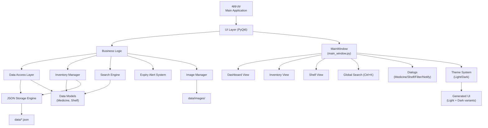
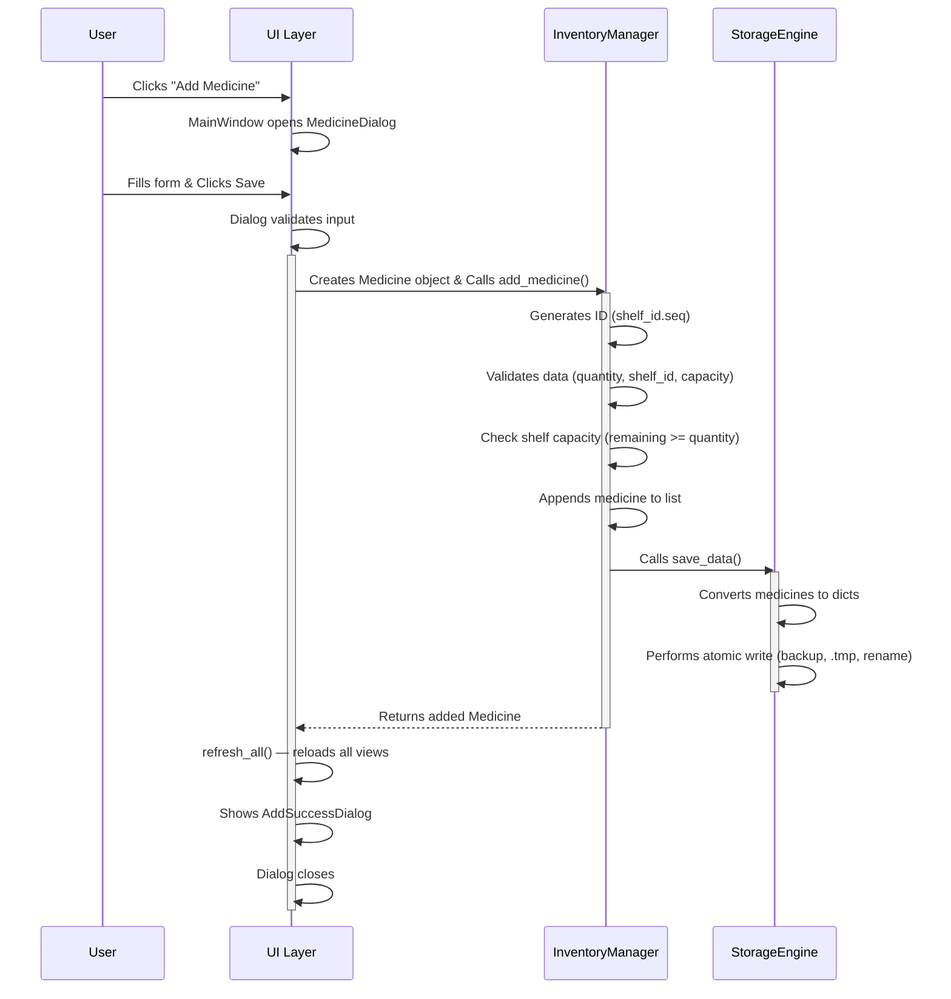
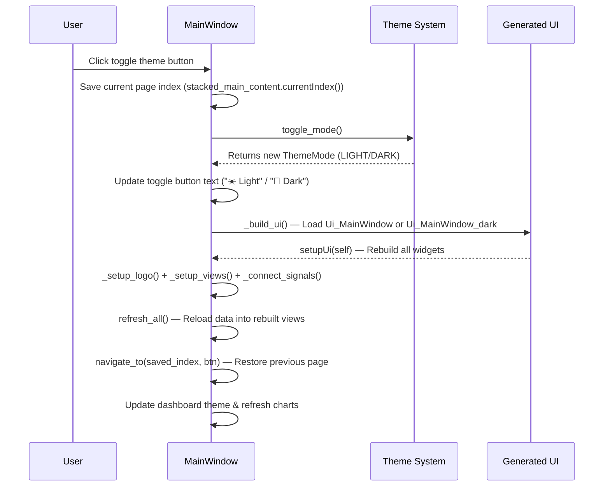
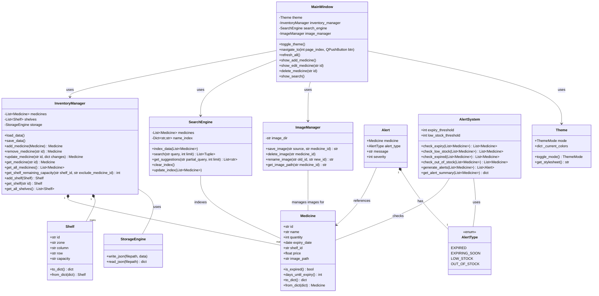
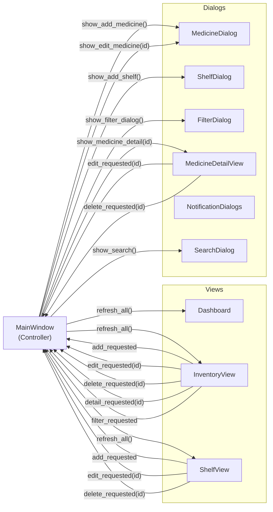

# Sơ đồ dự án: Hệ thống Quản lý Nhà thuốc

Tài liệu này trình bày các sơ đồ kiến trúc và sơ đồ luồng chính cho Hệ thống Quản lý Nhà thuốc, cung cấp một cái nhìn tổng quan trực quan về cấu trúc và chức năng của nó. Các sơ đồ này được tạo bằng cú pháp Mermaid, có thể được hiển thị bởi nhiều trình xem Markdown và công cụ tài liệu.

**Ngày cập nhật:** 26/03/2026

---

## 1. Sơ đồ Kiến trúc Thành phần

Sơ đồ này minh họa tổ chức cấp cao của Hệ thống Quản lý Nhà thuốc thành các lớp và thành phần riêng biệt, thể hiện các mối quan hệ và sự phụ thuộc chính của chúng.

```mermaid
graph TD
    App["app.py<br>Main Application"] --> UI["UI Layer (PyQt6)"]

    UI --> Logic[Business Logic]
    Logic --> Data[Data Access Layer]

    UI --> MainWin["MainWindow<br>(main_window.py)"]
    MainWin --> Dashboard[Dashboard View]
    MainWin --> InventoryView[Inventory View]
    MainWin --> ShelfView[Shelf View]
    MainWin --> SearchDlg["Global Search (Ctrl+K)"]
    MainWin --> Dialogs["Dialogs<br>(Medicine/Shelf/Filter/Notify)"]

    Logic --> InvMgr[Inventory Manager]
    Logic --> SearchEng[Search Engine]
    Logic --> AlertSys[Expiry Alert System]
    Logic --> ImgMgr[Image Manager]

    Data --> JSON_Store[JSON Storage Engine]
    Data --> Models["Data Models<br>(Medicine, Shelf)"]

    InvMgr --> Models
    InvMgr --> JSON_Store
    SearchEng --> Models
    ImgMgr --> Files2["data/images/"]
    JSON_Store --> Files["data/*.json"]

    MainWin --> ThemeSys["Theme System<br>(Light/Dark)"]
    ThemeSys --> GenUI["Generated UI<br>(Light + Dark variants)"]
```

### Giải thích:
-   **Main Application (`app.py`):** Đóng vai trò khởi tạo (bootstrap) hệ thống, tạo `QApplication` và `MainWindow`.
-   **MainWindow (`main_window.py`):** Hub trung tâm điều khiển tất cả views, dialogs, theme, search. Chỉ chứa business logic — layout được define trong generated UI files.
-   **UI Layer (PyQt6):** Xử lý tương tác người dùng và hiển thị thông tin. Gồm Dashboard, Inventory View, Shelf View, Search Dialog, và các Notification Dialogs.
-   **Business Logic Layer:** Chứa các quy tắc nghiệp vụ cốt lõi: Inventory Manager, Search Engine, Alert System, và Image Manager.
-   **Data Access Layer:** Chịu trách nhiệm lưu trữ và truy cập dữ liệu: JSON Storage Engine (atomic writes) và Data Models (Medicine, Shelf).
-   **Theme System:** Chọn giữa Light/Dark generated UI files tại runtime, giữ nguyên page index khi chuyển theme.

---

## 2. Sơ đồ Luồng Logic / Tuần tự (Thêm Thuốc)

Sơ đồ tuần tự này mô tả chi tiết sự tương tác giữa người dùng và các thành phần hệ thống khác nhau trong quá trình thêm một mục thuốc mới.

```mermaid
sequenceDiagram
    participant User
    participant UI as UI Layer
    participant IM as InventoryManager
    participant SE as StorageEngine

    User->>UI: Clicks "Add Medicine"
    UI->>UI: MainWindow opens MedicineDialog
    User->>UI: Fills form & Clicks Save
    UI->>UI: Dialog validates input
    activate UI
    UI->>IM: Creates Medicine object & Calls add_medicine()
    activate IM
    IM->>IM: Generates ID (shelf_id.seq)
    IM->>IM: Validates data (quantity, shelf_id, capacity)
    IM->>IM: Check shelf capacity (remaining >= quantity)
    IM->>IM: Appends medicine to list
    IM->>SE: Calls save_data()
    activate SE
    SE->>SE: Converts medicines to dicts
    SE->>SE: Performs atomic write (backup, .tmp, rename)
    deactivate SE
    IM-->>UI: Returns added Medicine
    deactivate IM
    UI->>UI: refresh_all() — reloads all views
    UI->>UI: Shows AddSuccessDialog
    UI->>UI: Dialog closes
    deactivate UI
```

### Giải thích:
-   Biểu đồ này theo dõi quy trình "Thêm thuốc" từ khi người dùng khởi tạo đến khi cập nhật UI và lưu trữ dữ liệu.
-   **Người dùng và UI:** Người dùng tương tác với giao diện đồ họa.
-   **Xác thực ở UI:** UI thực hiện xác thực đầu vào cơ bản (UX-level validation) trước khi chuyển dữ liệu.
-   **UI gọi InventoryManager:** UI chuyển dữ liệu thuốc đã được xác thực sơ bộ cho `InventoryManager`.
-   **Vai trò của InventoryManager:** Xử lý logic nghiệp vụ, bao gồm sinh ID tự động, xác thực quy tắc nghiệp vụ và cập nhật danh sách thuốc nội bộ.
-   **InventoryManager gọi StorageEngine:** `InventoryManager` ủy quyền việc lưu trữ dữ liệu cho `StorageEngine` để lưu các thay đổi vào tệp JSON.
-   **Ghi dữ liệu nguyên tử của StorageEngine:** `StorageEngine` đảm bảo tính toàn vẹn dữ liệu bằng cách sử dụng tệp tạm thời và thao tác đổi tên nguyên tử.
-   **Phản hồi về UI:** Sau khi lưu thành công, `MainWindow` gọi `refresh_all()` để cập nhật tất cả views (Dashboard, Inventory, Shelf), sau đó hiển thị dialog thông báo thành công.

---

## 3. Sơ đồ Luồng Chuyển Theme (Light ↔ Dark)

Sơ đồ này mô tả quá trình chuyển đổi giữa Light và Dark mode, đảm bảo trang hiện tại được giữ nguyên.

```mermaid
sequenceDiagram
    participant User
    participant MW as MainWindow
    participant Theme as Theme System
    participant GenUI as Generated UI

    User->>MW: Click toggle theme button
    MW->>MW: Save current page index (stacked_main_content.currentIndex())
    MW->>Theme: toggle_mode()
    Theme-->>MW: Returns new ThemeMode (LIGHT/DARK)
    MW->>MW: Update toggle button text ("☀️ Light" / "🌙 Dark")
    MW->>GenUI: _build_ui() — Load Ui_MainWindow or Ui_MainWindow_dark
    GenUI-->>MW: setupUi(self) — Rebuild all widgets
    MW->>MW: _setup_logo() + _setup_views() + _connect_signals()
    MW->>MW: refresh_all() — Reload data into rebuilt views
    MW->>MW: navigate_to(saved_index, btn) — Restore previous page
    MW->>MW: Update dashboard theme & refresh charts
```

### Giải thích:
-   **Page Index Persistence:** `currentIndex()` được lưu **trước khi** rebuild UI. Sau khi rebuild, `navigate_to()` khôi phục lại trang đang xem.
-   **Full UI Rebuild:** Toàn bộ widget tree được tạo lại với generated UI file tương ứng (light hoặc dark).
-   **Data Reload:** Tất cả views (Dashboard, Inventory, Shelf) được nạp lại data từ `InventoryManager`.
-   **Chart Refresh:** Dashboard charts được cập nhật màu sắc theo theme mới.

---

## 4. Sơ đồ Lớp

Sơ đồ này trình bày các lớp (class) cốt lõi của hệ thống, các thuộc tính (attribute), phương thức (method) chính và mối quan hệ giữa chúng.

```mermaid
classDiagram
    class Medicine {
        +str id
        +str name
        +int quantity
        +date expiry_date
        +str shelf_id
        +float price
        +str image_path
        +is_expired() bool
        +days_until_expiry() int
        +to_dict() dict
        +from_dict(dict) Medicine
    }

    class Shelf {
        +str id
        +str zone
        +str column
        +str row
        +str capacity
        +to_dict() dict
        +from_dict(dict) Shelf
    }

    class StorageEngine {
        +write_json(filepath, data)
        +read_json(filepath) dict
    }

    class InventoryManager {
        -List~Medicine~ medicines
        -List~Shelf~ shelves
        -StorageEngine storage
        +load_data()
        +save_data()
        +add_medicine(Medicine) Medicine
        +remove_medicine(str id) Medicine
        +update_medicine(str id, dict changes) Medicine
        +get_medicine(str id) Medicine
        +get_all_medicines() List~Medicine~
        +get_shelf_remaining_capacity(str shelf_id, str exclude_medicine_id) int
        +add_shelf(Shelf) Shelf
        +get_shelf(str id) Shelf
        +get_all_shelves() List~Shelf~
    }

    class SearchEngine {
        -List~Medicine~ medicines
        -Dict~str,str~ name_index
        +index_data(List~Medicine~)
        +search(str query, int limit) List~Tuple~
        +get_suggestions(str partial_query, int limit) List~str~
        +clear_index()
        +update_index(List~Medicine~)
    }

    class ImageManager {
        -str image_dir
        +save_image(str source, str medicine_id) str
        +delete_image(str medicine_id)
        +rename_image(str old_id, str new_id) str
        +get_image_path(str medicine_id) str
    }

    class AlertType {
        <<enum>>
        EXPIRED
        EXPIRING_SOON
        LOW_STOCK
        OUT_OF_STOCK
    }

    class Alert {
        +Medicine medicine
        +AlertType alert_type
        +str message
        +int severity
    }

    class AlertSystem {
        +int expiry_threshold
        +int low_stock_threshold
        +check_expiry(List~Medicine~) List~Medicine~
        +check_low_stock(List~Medicine~) List~Medicine~
        +check_expired(List~Medicine~) List~Medicine~
        +check_out_of_stock(List~Medicine~) List~Medicine~
        +generate_alerts(List~Medicine~) List~Alert~
        +get_alert_summary(List~Medicine~) dict
    }

    class Theme {
        +ThemeMode mode
        +dict _current_colors
        +toggle_mode() ThemeMode
        +get_stylesheet() str
    }

    class MainWindow {
        -Theme theme
        -InventoryManager inventory_manager
        -SearchEngine search_engine
        -ImageManager image_manager
        +toggle_theme()
        +navigate_to(int page_index, QPushButton btn)
        +refresh_all()
        +show_add_medicine()
        +show_edit_medicine(str id)
        +delete_medicine(str id)
        +show_search()
    }

    InventoryManager "1" *-- "many" Medicine
    InventoryManager "1" *-- "many" Shelf
    InventoryManager -- StorageEngine : uses
    AlertSystem -- Medicine : checks
    AlertSystem -- AlertType : uses
    Alert --> Medicine : references
    Alert "1" *-- "1" AlertType : has
    SearchEngine -- Medicine : indexes
    ImageManager -- Medicine : manages images for
    MainWindow --> InventoryManager : uses
    MainWindow --> SearchEngine : uses
    MainWindow --> ImageManager : uses
    MainWindow --> Theme : uses
```

### Giải thích:
-   **Medicine & Shelf:** Đây là các dataclass đại diện cho các thực thể dữ liệu cơ bản, với các phương thức để xác thực và tuần tự hóa (serialization).
-   **StorageEngine:** Đóng gói logic để đọc và ghi dữ liệu JSON vào tệp, đảm bảo tính toàn vẹn của dữ liệu.
-   **InventoryManager:** Thành phần logic nghiệp vụ trung tâm để quản lý các đối tượng `Medicine` và `Shelf`, thực hiện các thao tác CRUD và tương tác với `StorageEngine` để lưu trữ dữ liệu (persistence).
-   **SearchEngine:** Cung cấp khả năng tìm kiếm mờ (fuzzy search) cho các loại thuốc bằng thư viện `TheFuzz`, lập chỉ mục (indexing) tên thuốc để truy vấn hiệu quả.
-   **ImageManager:** Quản lý hình ảnh thuốc — lưu, xóa, đổi tên khi medicine ID thay đổi.
-   **AlertType & Alert:** `AlertType` là một enum cho các loại cảnh báo khác nhau, và `Alert` là một dataclass đại diện cho một cảnh báo cụ thể cho một loại thuốc.
-   **AlertSystem:** Giám sát kho thuốc về hạn sử dụng và mức tồn kho, tạo ra các đối tượng `Alert` dựa trên các ngưỡng đã xác định.
-   **Theme:** Quản lý Light/Dark mode với bộ color tokens riêng; `toggle_mode()` chuyển đổi giữa 2 mode.
-   **MainWindow:** Hub trung tâm kết nối tất cả services và views. Chứa logic CRUD, navigation, theme toggle, và search.
-   **Các mối quan hệ:**
    -   `InventoryManager` tổng hợp (aggregates) các đối tượng `Medicine` và `Shelf` (được biểu thị bằng `*--`).
    -   `InventoryManager` sử dụng `StorageEngine` (được biểu thị bằng `--`).
    -   `MainWindow` sử dụng tất cả services: `InventoryManager`, `SearchEngine`, `ImageManager`, `Theme`.
    -   `AlertSystem` và `SearchEngine` tương tác với các đối tượng `Medicine`.
    -   Các đối tượng `Alert` tham chiếu đến `Medicine` (thay vì sở hữu), và được kết hợp với `AlertType`.
    -   *Lưu ý:* Thuộc tính `capacity` của `Shelf` đại diện cho **tổng số đơn vị (quantity) thuốc tối đa** mà kệ có thể chứa. Khi thêm hoặc cập nhật thuốc, hệ thống kiểm tra tổng quantity trên kệ không vượt quá capacity. Thuộc tính này hiện là kiểu `str` trong mã nguồn nhưng được chuyển đổi sang `int` khi tính toán.

---

## 5. Sơ đồ Cấu trúc Tệp

Sơ đồ này cung cấp một biểu diễn trực quan về tổ chức thư mục và tệp của dự án, làm nổi bật các module chính.

```mermaid
graph TD
    A["Pharmacy Management System<br>(KiThuatLapTrinhNhom3/)"] --> B[src/]
    A --> C[tests/]
    A --> D[data/]
    A --> E[docs/]
    A --> F["Ui Qt/"]
    A --> G[design-ui/]
    A --> H[app.py]
    A --> I[requirements.txt]
    A --> J[context.md]

    B --> B1[__init__.py]
    B --> B2[models.py]
    B --> B3[storage.py]
    B --> B4[inventory_manager.py]
    B --> B5[alerts.py]
    B --> B6[search_engine.py]
    B --> B7[image_manager.py]
    B --> B8[ui/]

    B8 --> U1[main_window.py]
    B8 --> U2[dashboard.py]
    B8 --> U3[inventory_view.py]
    B8 --> U4[shelf_view.py]
    B8 --> U5[medicine_dialog.py]
    B8 --> U6[shelf_dialog.py]
    B8 --> U7[medicine_detail_view.py]
    B8 --> U8[filter_dialog.py]
    B8 --> U9[notification_dialogs.py]
    B8 --> U10[theme.py]
    B8 --> U11["generated/<br>⚠️ DO NOT EDIT"]

    U11 --> G1["main_window_ui.py<br>main_window_ui_dark.py"]
    U11 --> G2["search.py / search_dark.py"]
    U11 --> G3["them_thuoc.py / them_thuoc_dark.py"]
    U11 --> G4["them_ke.py / them_ke_dark.py"]
    U11 --> G5["thong_tin_thuoc.py / thong_tin_thuoc_dark.py"]
    U11 --> G6["Notification dialogs<br>(light + dark pairs)"]

    C --> C1[test_models.py]
    C --> C2[test_storage.py]
    C --> C3[test_inventory.py]
    C --> C4[test_alerts.py]
    C --> C5[test_search.py]
    C --> C6[test_image_manager.py]

    D --> D1[medicines.json]
    D --> D2[shelves.json]
    D --> D3[settings.json]
    D --> D4[images/]

    E --> E1[projectcharts.md]
    E --> E2[classflow.md]
    E --> E3[design_guideline.md]
    E --> E4[PROGRESS.md]
    E --> E5[QUICKSTART.md]
    E --> E6[SUMMARY.md]
    E --> E7[SCREENSHOTS.md]
```

### Giải thích:
-   **Thư mục gốc (Root Directory):** Chứa các tệp cấp dự án như `app.py`, `requirements.txt`, `context.md`, và các scripts (`run.bat`, `run_tests.bat`).
-   **`src/`:** Chứa mã nguồn chính của ứng dụng, được tách biệt một cách logic thành các module cho data models, storage, inventory management, alerts, search, và image management.
-   **`src/ui/`:** Chứa tất cả UI components — mỗi file chỉ chứa business logic, layout được define trong generated files.
-   **`src/ui/generated/`:** Files tự động sinh bởi `pyuic6` — mỗi dialog/form có 2 variants (light + dark). **KHÔNG ĐƯỢC CHỈNH SỬA THỦ CÔNG.**
-   **`tests/`:** Chứa ~107 unit tests cho mỗi module tương ứng trong thư mục `src/`.
-   **`data/`:** Dành cho lưu trữ dữ liệu ứng dụng: `medicines.json`, `shelves.json`, `settings.json`, và thư mục `images/` cho hình ảnh thuốc.
-   **`Ui Qt/`:** Chứa các tệp `.ui` gốc từ Qt Designer — mỗi form có 2 phiên bản (light + dark).
-   **`docs/`:** Tài liệu dự án bao gồm sơ đồ, hướng dẫn thiết kế, tiến độ, và tài liệu tóm tắt.

---

## 6. Sơ đồ Tương tác UI Components

Sơ đồ này thể hiện cách các UI components giao tiếp với nhau thông qua Qt Signal/Slot mechanism.

```mermaid
graph LR
    MW["MainWindow<br>(Controller)"]

    subgraph Views
        DV[Dashboard]
        IV[InventoryView]
        SV[ShelfView]
    end

    subgraph Dialogs
        MD[MedicineDialog]
        SD[ShelfDialog]
        FD[FilterDialog]
        DD[MedicineDetailView]
        ND[NotificationDialogs]
        SD2[SearchDialog]
    end

    IV -- "add_requested" --> MW
    IV -- "edit_requested(id)" --> MW
    IV -- "delete_requested(id)" --> MW
    IV -- "detail_requested(id)" --> MW
    IV -- "filter_requested" --> MW

    SV -- "add_requested" --> MW
    SV -- "edit_requested(id)" --> MW
    SV -- "delete_requested(id)" --> MW

    MW -- "show_add_medicine()" --> MD
    MW -- "show_edit_medicine(id)" --> MD
    MW -- "show_filter_dialog()" --> FD
    MW -- "show_medicine_detail(id)" --> DD
    MW -- "show_search()" --> SD2
    MW -- "show_add_shelf()" --> SD
    MW -- "refresh_all()" --> DV
    MW -- "refresh_all()" --> IV
    MW -- "refresh_all()" --> SV

    DD -- "edit_requested(id)" --> MW
    DD -- "delete_requested(id)" --> MW
```

### Giải thích:
-   **Signal/Slot Pattern:** Views (InventoryView, ShelfView) chỉ **phát signals** — không chứa business logic. MainWindow **lắng nghe** signals và xử lý logic.
-   **Unidirectional Flow:** Signals đi từ Views → MainWindow → Dialogs. Sau khi dialog hoàn thành, MainWindow gọi `refresh_all()` để cập nhật tất cả views.
-   **MedicineDetailView:** Cũng có thể phát `edit_requested` và `delete_requested` — cho phép chỉnh sửa/xóa trực tiếp từ màn hình chi tiết thuốc.