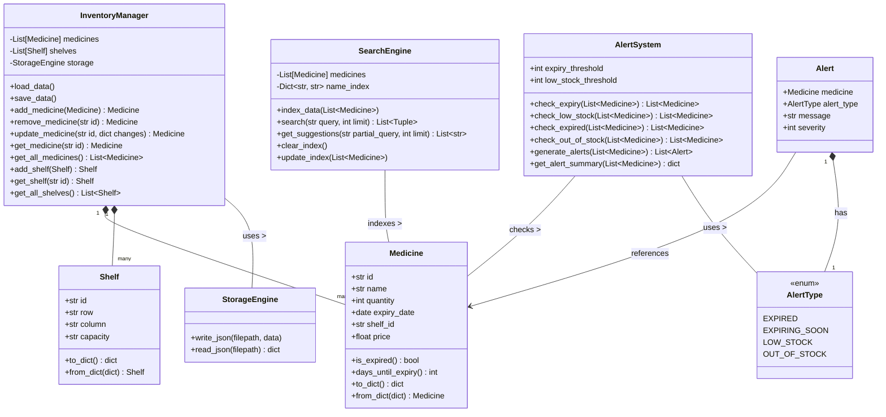
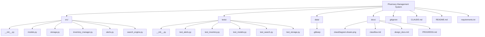

# Project Charts: Pharmacy Management System

This document outlines key architectural and flow diagrams for the Pharmacy Management System, providing a visual overview of its structure and functionality. These diagrams are generated using Mermaid syntax, which can be rendered by many Markdown viewers and documentation tools.

---

## 1. Component Architecture Diagram

This diagram illustrates the high-level organization of the Pharmacy Management System into distinct layers and components, showing their primary relationships and dependencies.

```mermaid
graph TD
    App[Main Application] --> UI[UI Layer (PyQt6)]

    UI --> Logic[Business Logic]
    Logic --> Data[Data Access Layer]

    UI --> Dashboard[Dashboard View]
    UI --> InventoryView[Inventory View]
    UI --> SearchBar[Global Search (Ctrl+K)]
    UI --> Reports[Reports (Matplotlib)]

    Logic --> InvMgr[Inventory Manager]
    Logic --> SearchEng[Search Engine]
    Logic --> AlertSys[Expiry Alert System]

    Data --> JSON_Store[JSON Storage Engine]
    Data --> Models[Data Models]

    InvMgr --> Models
    SearchEng --> Models
    JSON_Store --> Files[(JSON Files)]
```

### Explanation:
-   **Main Application:** Đóng vai trò khởi tạo (bootstrap) hệ thống.
-   **UI Layer (PyQt6):** Xử lý tương tác người dùng và hiển thị thông tin. Gọi các chức năng từ lớp Business Logic. Gồm các chế độ xem như Dashboard, Inventory View, Global Search và Reports.
-   **Business Logic Layer:** Chứa các quy tắc nghiệp vụ và hoạt động cốt lõi, được quản lý bởi Inventory Manager, Search Engine và Alert System.
-   **Data Access Layer:** Chịu trách nhiệm về việc lưu trữ và truy cập dữ liệu, bao gồm JSON Storage Engine và các Data Models (Medicine, Shelf).
-   **Dependencies:** Các mũi tên chỉ ra luồng điều khiển hoặc dữ liệu. Cụ thể, `UI Layer` gọi `Business Logic`, và `Business Logic` gọi `Data Access Layer` khi cần thiết. Ví dụ, `InventoryManager` phụ thuộc vào `Data Models` và `StorageEngine`.

---

## 2. Logic Flow / Sequence Diagram (for a Key Use Case: Add Medicine)

This sequence diagram details the interaction between the user and various system components during the process of adding a new medicine entry.


### Explanation:
-   Biểu đồ này theo dõi quy trình "Thêm thuốc" từ khi người dùng khởi tạo đến khi cập nhật UI và lưu trữ dữ liệu.
-   **Người dùng và UI:** Người dùng tương tác với giao diện đồ họa.
-   **Xác thực ở UI:** UI thực hiện xác thực đầu vào cơ bản (UX-level validation) trước khi chuyển dữ liệu.
-   **UI gọi InventoryManager:** UI chuyển dữ liệu thuốc đã được xác thực sơ bộ cho `InventoryManager`.
-   **Vai trò của InventoryManager:** Xử lý logic nghiệp vụ, bao gồm xác thực quy tắc nghiệp vụ (business rule validation) chi tiết hơn và cập nhật danh sách thuốc nội bộ.
-   **InventoryManager gọi StorageEngine:** `InventoryManager` ủy quyền việc lưu trữ dữ liệu cho `StorageEngine` để lưu các thay đổi vào tệp JSON.
-   **Ghi dữ liệu nguyên tử của StorageEngine:** `StorageEngine` đảm bảo tính toàn vẹn dữ liệu bằng cách sử dụng tệp tạm thời và thao tác đổi tên nguyên tử.
-   **Phản hồi về UI:** Sau khi lưu thành công, `InventoryManager` phát tín hiệu để UI làm mới hiển thị, cập nhật bảng kho và thanh trạng thái.

---

## 3. Class Diagram

This diagram presents the core classes of the system, their attributes, key methods, and the relationships between them.



### Explanation:
-   **Medicine & Shelf:** These are dataclasses representing the fundamental data entities, with methods for validation and serialization.
-   **StorageEngine:** Encapsulates the logic for reading and writing JSON data to files, ensuring data integrity.
-   **InventoryManager:** The central business logic component for managing `Medicine` and `Shelf` objects, performing CRUD operations and interacting with the `StorageEngine` for persistence.
-   **SearchEngine:** Provides fuzzy search capabilities for medicines using `TheFuzz` library, indexing medicine names for efficient querying.
-   **AlertType & Alert:** `AlertType` is an enumeration for different alert categories, and `Alert` is a dataclass representing a specific alert for a medicine.
-   **AlertSystem:** Monitors medicine inventory for expiry dates and stock levels, generating `Alert` objects based on defined thresholds.
    -   **Relationships:**
        -   `InventoryManager` aggregates `Medicine` và `Shelf` objects (được biểu thị bằng `*--`).
        -   `InventoryManager` sử dụng `StorageEngine` (được biểu thị bằng `-->`).
        -   `AlertSystem` và `SearchEngine` tương tác với các đối tượng `Medicine`.
        -   `Alert` objects `tham chiếu` đến `Medicine` (thay vì sở hữu), và được `kết hợp` với `AlertType`.
        -   *Lưu ý:* Thuộc tính `capacity` của `Shelf` hiện đang là kiểu `str` trong mã nguồn, nhưng nên được cân nhắc thay đổi thành `int` để đảm bảo tính toàn vẹn dữ liệu tốt hơn.
---

## 4. File Structure Diagram

This diagram provides a visual representation of the project's directory and file organization, highlighting the main modules.



### Explanation:
-   **Root Directory:** Contains project-level files like `.gitignore`, `README.md`, and `requirements.txt`.
-   **`src/`:** Houses the main source code of the application, logically separated into modules for data models, storage, inventory management, alerts, and search.
-   **`tests/`:** Contains unit tests for each corresponding module in the `src/` directory, ensuring code quality and functionality.
-   **`data/`:** Intended for storing application data, such as JSON files for persistence (e.g., `medicines.json`, `shelves.json`).
-   **`docs/`:** Holds documentation files, including design documents, progress reports, and now, these project charts.